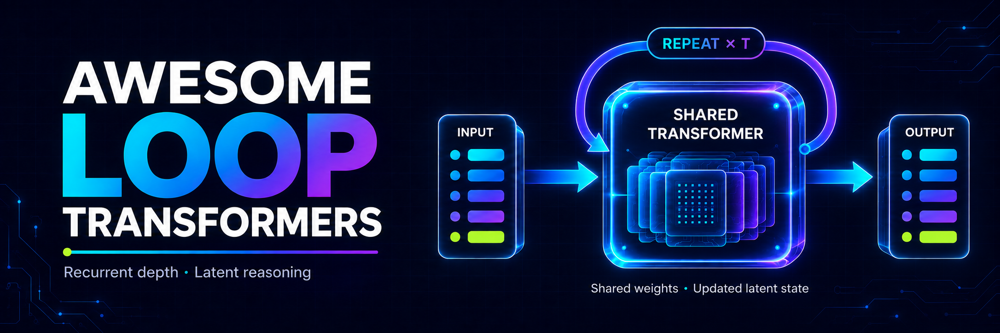

<!-- This file is generated from lib/papers.ts. Edit the data source, then run npm run artifacts. -->

<strong>English</strong>&nbsp;&nbsp;·&nbsp;&nbsp;<a href="README.zh-CN.md">简体中文</a>

<h1 align="center">Awesome Loop Transformers</h1>

<strong>Looped Transformers, latent reasoning, and test-time compute. A bilingual reading guide with papers, official code, and research summaries.</strong>

&nbsp;&nbsp;&nbsp;&nbsp;

<a href="https://awesome-loop-transformers.bright-haven-2369.chatgpt.site/#catalog"><strong>Search the interactive catalog ↗</strong></a>&nbsp;&nbsp;·&nbsp;&nbsp;<a href="https://github.com/Mrkkew/Awesome-Loop-Transformers/issues/new?template=paper-suggestion.yml">Suggest a paper</a>

<a href="#start-here"><strong>🧭 Start here</strong></a>&nbsp;&nbsp;·&nbsp;&nbsp;<a href="#essential-reading"><strong>📌 Essential reading</strong></a>&nbsp;&nbsp;·&nbsp;&nbsp;<a href="#complete-catalog"><strong>📚 Full catalog</strong></a>&nbsp;&nbsp;·&nbsp;&nbsp;<a href="#contributing"><strong>🤝 Contribute</strong></a>

142 papers · 7 research topics · English / 简体中文 · Last research update: 2026-09-05

---

## Start here

- **Understand the architecture** — [Universal Transformers](https://arxiv.org/abs/1807.03819) → [programmable loops](https://proceedings.mlr.press/v202/giannou23a.html) → [foundations and theory](#foundations--theory).
- **Study reasoning and scaling** — [Huginn](https://arxiv.org/abs/2502.05171) → [Ouro](https://arxiv.org/abs/2510.25741) → [adaptive compute](#adaptive-compute) and [parallel loops](https://arxiv.org/abs/2510.24824).
- **Explore related methods** — [Coconut](https://arxiv.org/abs/2412.06769), [HRM](https://arxiv.org/abs/2506.21734), and [TRM](https://arxiv.org/abs/2510.04871) → [broader latent reasoning](#broader-latent-reasoning).

→ [Compare the mechanisms and learn what to measure](docs/reading-guide.md): recurrent depth, continuous thoughts, routing, and parallel loops.

## Essential reading

Eight entry points, from shared-depth architectures to latent reasoning. Short names link to the original papers; this is a reading selection, not a ranking.

| Paper / model | Research question |
| --- | --- |
| **[Universal Transformers](https://arxiv.org/abs/1807.03819)** 2018 | How can one shared Transformer transition replace a fixed stack of layers? |
| **[Programmable Looped Transformers](https://proceedings.mlr.press/v202/giannou23a.html)** 2023 | What kinds of iterative algorithms can a looped Transformer execute? |
| **[Huginn](https://arxiv.org/abs/2502.05171)** 2025 | Can additional recurrent depth improve reasoning without generating more tokens? |
| **[Ouro](https://arxiv.org/abs/2510.25741)** 2025 | How can looped language models be pretrained and their depth allocation learned? |
| **[Mixture-of-Recursions](https://arxiv.org/abs/2507.10524)** 2025 | How can a shared model assign different recursion depths to individual tokens? |
| **[Parallel Loop Transformer](https://arxiv.org/abs/2510.24824)** 2025 | How can loop execution reduce sequential latency and KV-cache overhead? |
| **[Coconut](https://arxiv.org/abs/2412.06769)** 2024 | How can hidden states serve as intermediate thoughts? · Broader latent reasoning |
| **[Tiny Recursive Model (TRM)](https://arxiv.org/abs/2510.04871)** 2025 | How can a small shared network alternately refine latent states and candidate answers? · Broader latent reasoning |

## What this list covers

**Looped Transformers:** models that reuse a learned Transformer layer, block, or stack through depth within a forward pass, alongside related theory, training, systems, and applications.

**Broader latent reasoning:** selected work on continuous thoughts, implicit CoT, and recursive reasoning, including Coconut, HRM, and TRM. These methods need not use a looped Transformer and are listed separately.

Of the **137 works from 2024 onward**, **111** belong to the core track and **26** to broader latent reasoning. Earlier foundations are also included.

## Complete catalog

Choose a topic below, then expand a year. Papers are ordered newest first within each group. For title, author, or model search, use the [interactive catalog](https://awesome-loop-transformers.bright-haven-2369.chatgpt.site/#catalog).

| Track | Works | What it covers |
| --- | :---: | --- |
| **[Foundations & Theory](#foundations--theory)** | 20 | Expressivity, programmability, in-context optimization, length and depth generalization. |
| **[Architectures & Scaling](#architectures--scaling)** | 26 | Weight sharing, recurrent cores, MoE, multi-resolution designs, and scaling laws. |
| **[Latent Reasoning](#latent-reasoning)** | 12 | Test-time depth, silent multi-step computation, Huginn, Ouro, and latent CoT. |
| **[Adaptive Compute](#adaptive-compute)** | 11 | Token routing, learned halting, early exit, and budget-conditioned depth. |
| **[Training & Analysis](#training--analysis)** | 23 | Optimization, stability, residual scaling, fixed points, and mechanistic studies. |
| **[Systems & Applications](#systems--applications)** | 24 | Serving, KV memory, parallel loops, code, multimodal, robotics, and tool use. |
| **[Broader Latent Reasoning](#broader-latent-reasoning)** | 26 | Continuous thoughts, implicit CoT, hierarchical recurrence, HRM, and TRM. |

### Foundations & Theory

<strong>2026</strong> · 4 papers

- **[When Does Recurrence Become an Algorithm? Convergence Selection in Weight-Tied Looped Transformers](https://arxiv.org/abs/2607.20594)** 
  Tong Zhang et al. · *arXiv 2026* 
  Uses controlled group-word tasks to show how weight tying and training budgets select serial computation frontiers, and introduces convergence-time scaling as a mechanistic diagnostic. 
  [Paper](https://arxiv.org/abs/2607.20594)

- **[Looped Transformers with Layer Normalization Provably Learn the Power Method](https://arxiv.org/abs/2606.00605)** 
  Lyumin Wu, Chenyang Zhang, Yuan Cao · *arXiv 2026* 
  Proves that gradient descent selects a looped, layer-normalized solution implementing one power iteration per attention application. 
  [Paper](https://arxiv.org/abs/2606.00605)

- **[Chain-of-Thought and Compressed Looped Transformers: A Memory-Budget Separation](https://arxiv.org/abs/2605.30757)** 
  Haozhou Zhang · *arXiv 2026* 
  Formalizes a memory-capacity separation: extra iterations do not give compressed latent loops the growing scratchpad available to polynomial-length chain of thought. 
  [Paper](https://arxiv.org/abs/2605.30757)

- **[Stability and Generalization in Looped Transformers](https://arxiv.org/abs/2604.15259)** 
  Asher Labovich · *arXiv 2026* 
  Characterizes how recall connections and normalization affect reachable, input-dependent fixed points and depth generalization. 
  [Paper](https://arxiv.org/abs/2604.15259) · [Code](https://github.com/ashlab11/generalization)

<strong>2025</strong> · 4 papers

- **[To CoT or To Loop? A Formal Comparison Between Chain-of-Thought and Looped Transformers](https://arxiv.org/abs/2505.19245)** 
  Kevin Xu, Issei Sato · *arXiv 2025* 
  Separates the strengths of the two compute axes: loops efficiently simulate parallel deterministic computation, while stochastic CoT favors some self-reducible problems. 
  [Paper](https://arxiv.org/abs/2505.19245)

- **[A Little Depth Goes a Long Way: The Expressive Power of Log-Depth Transformers](https://openreview.net/forum?id=njycONK0JG)** 
  William Merrill, Ashish Sabharwal · *ICLR 2025* 
  Shows that a universally shared block unrolled only logarithmically with input length can recognize regular languages and solve graph connectivity beyond fixed-depth limits. 
  [Paper](https://openreview.net/forum?id=njycONK0JG)

- **[Transformers Learn to Implement Multi-step Gradient Descent with Chain of Thought](https://arxiv.org/abs/2502.21212)** 
  Jianhao Huang, Zixuan Wang, Jason D. Lee · *arXiv 2025* 
  Analyzes how CoT training induces multi-step in-context gradient descent and uses the same tools to show a performance gain from looping. 
  [Paper](https://arxiv.org/abs/2502.21212)

- **[Neural Algorithmic Reasoning for Hypergraphs with Looped Transformers](https://arxiv.org/abs/2501.10688)** 
  Zekai Huang et al. · *arXiv 2025* 
  Extends constructive looped-Transformer simulations from graphs to hypergraphs through graph reductions and hyperedge-aware encodings for algorithms such as Dijkstra and Helly. 
  [Paper](https://arxiv.org/abs/2501.10688)

<strong>2024</strong> · 7 papers

- **[On the Role of Depth and Looping for In-Context Learning with Task Diversity](https://arxiv.org/abs/2410.21698)** 
  Khashayar Gatmiry et al. · *arXiv 2024* 
  Establishes depth requirements for diverse in-context regression tasks and argues that weight-tied looping retains expressivity while improving robustness and monotonicity across depth. 
  [Paper](https://arxiv.org/abs/2410.21698)

- **[Bypassing the Exponential Dependency: Looped Transformers Efficiently Learn In-context by Multi-step Gradient Descent](https://arxiv.org/abs/2410.11268)** 
  Bo Chen et al. · *arXiv 2024* 
  Proves that linear looped Transformers can implement multi-step gradient descent for in-context learning without requiring exponentially many demonstrations. 
  [Paper](https://arxiv.org/abs/2410.11268)

- **[Looped ReLU MLPs May Be All You Need as Practical Programmable Computers](https://arxiv.org/abs/2410.09375)** 
  Yingyu Liang et al. · *arXiv 2024* 
  Shows that a compact looped ReLU MLP can implement the primitive operations of a programmable computer, providing a non-attention comparison point for looped Transformer expressivity. 
  [Paper](https://arxiv.org/abs/2410.09375)

- **[Can Looped Transformers Learn to Implement Multi-step Gradient Descent for In-context Learning?](https://arxiv.org/abs/2410.08292)** 
  Khashayar Gatmiry et al. · *arXiv 2024* 
  Moves beyond construction results by analyzing optimization: population-risk minimizers and gradient flow learn a data-adapted multi-step preconditioned gradient method. 
  [Paper](https://arxiv.org/abs/2410.08292)

- **[On Expressive Power of Looped Transformers: Theoretical Analysis and Enhancement via Timestep Encoding](https://proceedings.mlr.press/v267/xu25x.html)** 
  Kevin Xu, Issei Sato · *ICML 2025* 
  Derives approximation guarantees and a loop-specific limitation, then uses timestep-conditioned scaling to give repeated blocks distinct behavior. 
  [Paper](https://proceedings.mlr.press/v267/xu25x.html) · [Code](https://github.com/kevin671/tmlt)

- **[Looped Transformers for Length Generalization](https://openreview.net/forum?id=2edigk8yoU)** 
  Ying Fan et al. · *ICLR 2025* 
  Trains a decoder-only looped Transformer to match iteration count to problem length, enabling strong extrapolation on iterative algorithmic tasks. 
  [Paper](https://openreview.net/forum?id=2edigk8yoU) · [Code](https://github.com/UW-Madison-Lee-Lab/looped-tf)

- **[Simulation of Graph Algorithms with Looped Transformers](https://arxiv.org/abs/2402.01107)** 
  Artur Back de Luca, Kimon Fountoulakis · *arXiv 2024* 
  Constructs looped Transformers that execute shortest-path, traversal, and connectivity algorithms on arbitrary-size graphs, while making finite-precision limits explicit. 
  [Paper](https://arxiv.org/abs/2402.01107) · [Code](https://github.com/watcl-lab/graphalgosimulation)

<strong>2023</strong> · 2 papers

- **[Looped Transformers are Better at Learning Learning Algorithms](https://openreview.net/forum?id=HHbRxoDTxE)** 
  Liu Yang et al. · *ICLR 2024* 
  Shows that repeatedly applying a small shared Transformer can learn iterative in-context fitting algorithms with far fewer parameters than a deep untied model. 
  [Paper](https://openreview.net/forum?id=HHbRxoDTxE) · [Code](https://github.com/Leiay/looped_transformer)

- **[Looped Transformers as Programmable Computers](https://proceedings.mlr.press/v202/giannou23a.html)** 
  Angeliki Giannou et al. · *ICML 2023* 
  Constructs constant-size Transformer blocks that execute iterative programs when looped, making the computational role of recurrent depth explicit. 
  [Paper](https://proceedings.mlr.press/v202/giannou23a.html) · [Code](https://github.com/jysohn1108/Looped-Transformer)

<strong>2019</strong> · 1 paper

- **[Deep Equilibrium Models](https://arxiv.org/abs/1909.01377)** 
  Shaojie Bai, J. Zico Kolter, Vladlen Koltun · *NeurIPS 2019* 
  Treats infinitely deep weight-tied networks as fixed-point systems, providing an implicit-depth counterpart to explicitly unrolled loops. 
  [Paper](https://arxiv.org/abs/1909.01377) · [Code](https://github.com/locuslab/deq)

<strong>2018</strong> · 1 paper

- **[Universal Transformers](https://arxiv.org/abs/1807.03819)** 
  Mostafa Dehghani et al. · *ICLR 2019* 
  Establishes the canonical depth-recurrent Transformer: one shared transition repeatedly refines every token, optionally with adaptive halting. 
  [Paper](https://arxiv.org/abs/1807.03819) · [Code](https://github.com/tensorflow/tensor2tensor)

<strong>2016</strong> · 1 paper

- **[Adaptive Computation Time for Recurrent Neural Networks](https://arxiv.org/abs/1603.08983)** 
  Alex Graves · *arXiv 2016* 
  Introduces a differentiable halting mechanism that lets recurrent models spend different amounts of computation on different inputs. 
  [Paper](https://arxiv.org/abs/1603.08983)

[↑ Back to catalog](#complete-catalog)

### Architectures & Scaling

<strong>2026</strong> · 19 papers

- **[SMELT: Scaling Laws for Compute-Matched MoE Looped Transformers](https://arxiv.org/abs/2609.01343)** 
  Shaowen Wang et al. · *arXiv 2026* 
  Evaluates looped MoE models while jointly matching FLOPs, non-embedding parameters, and KV cache, separating architectural effects from extra compute. 
  [Paper](https://arxiv.org/abs/2609.01343)

- **[Squeezing More from Limited Data with Recursive Transformers](https://arxiv.org/abs/2608.26973)** 
  Serdar Gülbahar et al. · *arXiv 2026* 
  Studies recursive weight sharing when pretraining data are scarce, coupling it with factorized embeddings to spend compute without over-expanding parameter capacity. 
  [Paper](https://arxiv.org/abs/2608.26973)

- **[Allocating Recurrent Compute in Looped Language Models](https://arxiv.org/abs/2608.18230)** 
  Ruhai Lin et al. · *arXiv 2026* 
  Asks which sublayer should recur and finds that repeatedly applying the sequence mixer can retain much of the loop benefit without repeating every FFN. 
  [Paper](https://arxiv.org/abs/2608.18230)

- **[Gated Recurrent Transformers: Expressive Depth through Recurrent Modulation](https://arxiv.org/abs/2608.15062)** 
  Amr Hegazy et al. · *arXiv 2026* 
  Modulates a shared recurrent core with a learned update gate and fresh noise, allowing repeated applications to specialize by step. 
  [Paper](https://arxiv.org/abs/2608.15062)

- **[Looped Transformers with Source-Centered State Evolution](https://arxiv.org/abs/2607.27656)** 
  Bum Jun Kim et al. · *arXiv 2026* 
  Defines recurrence around a learned input-conditioned anchor whose zero deviation is exactly invariant, removing the forcing bias created by repeated additive input injection. 
  [Paper](https://arxiv.org/abs/2607.27656)

- **[Mobius Learning: Cyclic Depth Folding in Transformers](https://arxiv.org/abs/2607.17843)** 
  Tongtian Zhu · *arXiv 2026* 
  Rotates block order across data streams so each shared group learns both shallow and deep roles, exploring cyclic depth folding beyond a fixed loop order. 
  [Paper](https://arxiv.org/abs/2607.17843)

- **[Loop the Loopies!](https://arxiv.org/abs/2607.16051)** 
  Zitian Gao et al. · *arXiv 2026* 
  Develops a large-scale looped MoE recipe that reinvests parameter-memory savings while comparing against compute-matched sparse baselines. 
  [Paper](https://arxiv.org/abs/2607.16051)

- **[LoopMoE: Unifying Iterative Computation with Mixture-of-Experts for Language Modeling](https://arxiv.org/abs/2606.04438)** 
  Wenkai Chen et al. · *arXiv 2026* 
  Couples repeated shared computation with sparse expert routing, seeking both iterative refinement and expandable parameter capacity. 
  [Paper](https://arxiv.org/abs/2606.04438)

- **[CART: Context-Anchored Recurrent Transformer -- A Parameter-Efficient Architecture with Learned Stability](https://arxiv.org/abs/2606.01495)** 
  Chad A. Capps · *arXiv 2026* 
  Cross-attends a recurrent core to frozen context keys and values under a learned stability gate; controlled experiments also document where this recipe fails to beat dense baselines or extrapolate in depth. 
  [Paper](https://arxiv.org/abs/2606.01495)

- **[A Dual-Path Architecture for Scaling Compute and Capacity in LLMs](https://arxiv.org/abs/2605.30202)** 
  Markus Frey et al. · *arXiv 2026* 
  Pairs a repeatedly applied deep sublayer with a single-pass wide feed-forward path, allowing token-wise gates to trade iterative compute against one-step parameter capacity. 
  [Paper](https://arxiv.org/abs/2605.30202)

- **[Latent Recurrent Transformer: Architecture Exploration, Training Strategies, and Scaling Behavior](https://arxiv.org/abs/2605.26797)** 
  Zeyi Huang et al. · *arXiv 2026* 
  Carries a high-level hidden state from one token into the next while preserving the standard KV-cache interface, and introduces interleaved parallel training for the cross-token recurrence. 
  [Paper](https://arxiv.org/abs/2605.26797)

- **[LoopUS: Recasting Pretrained LLMs into Looped Latent Refinement Models](https://arxiv.org/abs/2605.11011)** 
  Taekhyun Park et al. · *arXiv 2026* 
  Transforms an existing pretrained LLM into a looped latent-refinement model instead of training recurrent depth entirely from scratch. 
  [Paper](https://arxiv.org/abs/2605.11011) · [Code](https://github.com/Thrillcrazyer/LoopUS) · [Project](https://thrillcrazyer.github.io/LoopUS)

- **[Sparse Layers are Critical to Scaling Looped Language Models](https://arxiv.org/abs/2605.09165)** 
  Ryan Lee et al. · *arXiv 2026* 
  Finds that adding sparse capacity is especially important when scaling recurrent language models, improving their quality–memory trade-off and exit behavior. 
  [Paper](https://arxiv.org/abs/2605.09165)

- **[Hyperloop Transformers](https://arxiv.org/abs/2604.21254)** 
  Abbas Zeitoun et al. · *arXiv 2026* 
  Loops only a middle layer block and adds hyper-connections between visits, targeting strong language modeling under model-memory constraints and quantization. 
  [Paper](https://arxiv.org/abs/2604.21254)

- **[How Much Is One Recurrence Worth? Iso-Depth Scaling Laws for Looped Language Models](https://arxiv.org/abs/2604.21106)** 
  Kristian Schwethelm et al. · *arXiv 2026* 
  Quantifies the quality value of a repeated layer relative to a unique layer under matched effective depth and training compute. 
  [Paper](https://arxiv.org/abs/2604.21106) · [Code](https://github.com/kschwethelm/looped-lm-scaling)

- **[Ouroboros: Dynamic Weight Generation for Recursive Transformers via Input-Conditioned LoRA Modulation](https://arxiv.org/abs/2604.02051)** 
  Jaber Jaber, Osama Jaber · *arXiv 2026* 
  Uses a compact controller to generate input- and step-conditioned modulation over shared LoRA bases, giving a recursive block different effective transformations at each visit. 
  [Paper](https://arxiv.org/abs/2604.02051) · [Code](https://github.com/RightNow-AI/ouroboros)

- **[Adaptive Loops and Memory in Transformers: Think Harder or Know More?](https://arxiv.org/abs/2603.08391)** 
  Markus Frey et al. · *arXiv 2026* 
  Combines learned per-layer looping with gated memory banks, separating extra iterative computation from additional learned storage and revealing different benefits across task types. 
  [Paper](https://arxiv.org/abs/2603.08391)

- **[SpiralFormer: Looped Transformers Can Learn Hierarchical Dependencies via Multi-Resolution Recursion](https://arxiv.org/abs/2602.11698)** 
  Chengting Yu et al. · *arXiv 2026* 
  Runs successive recurrences at multiple sequence resolutions, turning resolution into another axis for efficient hierarchical computation. 
  [Paper](https://arxiv.org/abs/2602.11698)

- **[Depth-Recurrent Attention Mixtures: Giving Latent Reasoning the Attention it Deserves](https://arxiv.org/abs/2601.21582)** 
  Jonas Knupp et al. · *arXiv 2026* 
  Diversifies the attention transformations available across repeated depth while preserving a recurrent core. 
  [Paper](https://arxiv.org/abs/2601.21582)

<strong>2025</strong> · 4 papers

- **[Improving Recursive Transformers with Mixture of LoRAs](https://arxiv.org/abs/2512.12880)** 
  Mohammadmahdi Nouriborji et al. · *arXiv 2025* 
  Restores some layer-wise expressivity lost to recursive weight sharing by inserting token-conditioned LoRA experts into a shared feed-forward network. 
  [Paper](https://arxiv.org/abs/2512.12880)

- **[Teaching Pretrained Language Models to Think Deeper with Retrofitted Recurrence](https://arxiv.org/abs/2511.07384)** 
  Sean McLeish et al. · *arXiv 2025* 
  Converts dense pretrained models into recurrent-depth models through continued training, testing how much loop behavior can be installed after pretraining. 
  [Paper](https://arxiv.org/abs/2511.07384) · [Code](https://github.com/mcleish7/retrofitting-recurrence)

- **[MeSH: Memory-as-State-Highways for Recursive Transformers](https://arxiv.org/abs/2510.07739)** 
  Chengting Yu et al. · *arXiv 2025* 
  Adds an explicit memory buffer and lightweight routers to separate long-lived from transient state and encourage distinct computation at different recursive steps. 
  [Paper](https://arxiv.org/abs/2510.07739) · [Code](https://github.com/LivingFutureLab/MeSH)

- **[Two-Scale Latent Dynamics for Recurrent-Depth Transformers](https://arxiv.org/abs/2509.23314)** 
  Francesco Pappone et al. · *arXiv 2025* 
  Introduces fast and slow latent dynamics so a recurrent-depth model can separate local refinement from longer-horizon state evolution. 
  [Paper](https://arxiv.org/abs/2509.23314)

<strong>2024</strong> · 3 papers

- **[Relaxed Recursive Transformers: Effective Parameter Sharing with Layer-wise LoRA](https://openreview.net/forum?id=WwpYSOkkCt)** 
  Sangmin Bae et al. · *ICLR 2025* 
  Folds pretrained Transformers into repeated blocks and restores depth-specific flexibility with small LoRA adapters, while motivating continuous depth-wise batching. 
  [Paper](https://openreview.net/forum?id=WwpYSOkkCt)

- **[MoEUT: Mixture-of-Experts Universal Transformers](https://proceedings.neurips.cc/paper_files/paper/2024/hash/321387ba926b8e58d3591c0aeb52ffc2-Abstract-Conference.html)** 
  Róbert Csordás et al. · *NeurIPS 2024* 
  Adds sparse expert capacity and improved recurrent dynamics to Universal Transformers, narrowing the quality gap with standard language models. 
  [Paper](https://proceedings.neurips.cc/paper_files/paper/2024/hash/321387ba926b8e58d3591c0aeb52ffc2-Abstract-Conference.html) · [Code](https://github.com/robertcsordas/moeut)

- **[AlgoFormer: An Efficient Transformer Framework with Algorithmic Structures](https://openreview.net/forum?id=oYP2Pd5aQt)** 
  Yihang Gao et al. · *TMLR 2025* 
  Combines task-specific pre- and post-processing blocks with a reusable middle block, injecting an iterative algorithmic prior into Transformer learning. 
  [Paper](https://openreview.net/forum?id=oYP2Pd5aQt) · [Code](https://github.com/chuanyang-Zheng/Algoformer)

[↑ Back to catalog](#complete-catalog)

### Latent Reasoning

<strong>2026</strong> · 7 papers

- **[Penelope: Localized Latent Recurrence for Efficient Structured Reasoning](https://arxiv.org/abs/2607.25915)** 
  Yutong Chen et al. · *arXiv 2026* 
  Restricts recurrent refinement to a middle decoder interval anchored by a cached prefix, reducing the cost of latent reasoning without repeatedly running the full model. 
  [Paper](https://arxiv.org/abs/2607.25915)

- **[T^2MLR: Transformer with Temporal Middle-Layer Recurrence](https://arxiv.org/abs/2607.15178)** 
  Ziyang Cai et al. · *arXiv 2026* 
  Feeds a cached middle-layer representation from the previous token into an earlier layer of the current token, preserving latent computation across decoding steps with localized recurrence. 
  [Paper](https://arxiv.org/abs/2607.15178)

- **[DiscoLoop: Looping Discrete Embeddings and Continuous Hidden States for Multi-hop Reasoning](https://arxiv.org/abs/2607.00341)** 
  Hengyu Fu et al. · *arXiv 2026* 
  Carries both a discrete embedding channel and a continuous hidden-state channel through recurrence, addressing a gap between decodable bridge entities and token-aligned representations. 
  [Paper](https://arxiv.org/abs/2607.00341)

- **[Bridging the Gap Between Latent and Explicit Reasoning with Looped Transformers](https://arxiv.org/abs/2606.31779)** 
  Ying Fan, Anej Svete, Kangwook Lee · *arXiv 2026* 
  LOTUS supervises parallel latent slots against explicit reasoning steps, bringing latent looped reasoning closer to chain-of-thought quality with lower thought latency. 
  [Paper](https://arxiv.org/abs/2606.31779)

- **[Solve the Loop: Attractor Models for Language and Reasoning](https://arxiv.org/abs/2605.12466)** 
  Jacob Fein-Ashley, Paria Rashidinejad · *arXiv 2026* 
  Replaces fixed unrolling with an attractor module solved to convergence and trained by implicit differentiation, enabling adaptive effective depth with constant training memory. 
  [Paper](https://arxiv.org/abs/2605.12466)

- **[Latent Chain-of-Thought Improves Structured-Data Transformers](https://arxiv.org/abs/2605.11262)** 
  Carson Dudley, Samet Oymak · *arXiv 2026* 
  Feeds compressed query-position states back as extra tokens for repeated processing, extending latent test-time computation to tabular prediction and time-series forecasting. 
  [Paper](https://arxiv.org/abs/2605.11262)

- **[Thinking Deeper, Not Longer: Depth-Recurrent Transformers for Compositional Generalization](https://arxiv.org/abs/2603.21676)** 
  Hung-Hsuan Chen · *arXiv 2026* 
  Tests whether recurrent latent depth, rather than longer decoded rationales, improves systematic composition outside the training distribution. 
  [Paper](https://arxiv.org/abs/2603.21676)

<strong>2025</strong> · 5 papers

- **[Closed-Loop Transformers: Autoregressive Modeling as Iterative Latent Equilibrium](https://arxiv.org/abs/2511.21882)** 
  Akbar Anbar Jafari, Gholamreza Anbarjafari · *arXiv 2025* 
  Proposes refining each token’s latent state toward a learned energy-based equilibrium before generation, framing autoregressive prediction as a closed-loop correction process. 
  [Paper](https://arxiv.org/abs/2511.21882)

- **[Scaling Latent Reasoning via Looped Language Models](https://arxiv.org/abs/2510.25741)** 
  Rui-Jie Zhu et al. · *arXiv 2025* 
  Introduces Ouro, pretrained looped language models with entropy-regularized depth allocation, and studies recurrent depth as a distinct scaling direction. 
  [Paper](https://arxiv.org/abs/2510.25741) · [Project](https://ouro-llm.github.io/)

- **[Reasoning with Latent Thoughts: On the Power of Looped Transformers](https://openreview.net/forum?id=din0lGfZFd)** 
  Nikunj Saunshi et al. · *ICLR 2025* 
  Connects recurrence to latent multi-step reasoning theoretically and empirically, showing that effective depth can matter more than unique parameter depth. 
  [Paper](https://openreview.net/forum?id=din0lGfZFd)

- **[Enhancing Auto-regressive Chain-of-Thought through Loop-Aligned Reasoning](https://arxiv.org/abs/2502.08482)** 
  Qifan Yu et al. · *arXiv 2025* 
  RELAY aligns visible reasoning steps with loop iterations, using intermediate supervision to generate length-generalizing rationales that then improve an autoregressive model. 
  [Paper](https://arxiv.org/abs/2502.08482) · [Code](https://github.com/qifanyu/RELAY)

- **[Scaling up Test-Time Compute with Latent Reasoning: A Recurrent Depth Approach](https://arxiv.org/abs/2502.05171)** 
  Jonas Geiping et al. · *NeurIPS 2025* 
  Scales recurrent depth to a 3.5B-parameter, 800B-token language model and shows that extra test-time loops can improve reasoning without emitting more tokens. 
  [Paper](https://arxiv.org/abs/2502.05171) · [Code](https://github.com/seal-rg/recurrent-pretraining) · [Project](https://huggingface.co/tomg-group-umd/huginn-0125)

[↑ Back to catalog](#complete-catalog)

### Adaptive Compute

<strong>2026</strong> · 8 papers

- **[RecurTrace: Adaptive Latent Reasoning with Loop-Time Memory](https://arxiv.org/abs/2609.03379)** 
  Yuxiang Wang et al. · *arXiv 2026* 
  Lets each repeated layer attend over its own prior loop states and trains a halting head from loss-improvement supervision, combining loop-time memory with input-adaptive depth. 
  [Paper](https://arxiv.org/abs/2609.03379)

- **[Per-Token Fixed-Point Convergence in Depth-Recurrent Transformers](https://arxiv.org/abs/2607.14427)** 
  Joe Logan · *arXiv 2026* 
  Measures token-specific convergence depths and shows that a training-free stability rule can halt settled tokens earlier than a learned router at the studied scale. 
  [Paper](https://arxiv.org/abs/2607.14427)

- **[Adaptive Depth in Looped Transformers: Diagnosing Learned Halting Gates and Trajectory Readouts](https://arxiv.org/abs/2607.20519)** 
  Andrei Cristian Popescu et al. · *arXiv 2026* 
  Separates trajectory formation from exit readout and finds that simple post-hoc confidence rules can rival learned gates when the recurrent trajectory is shaped independently. 
  [Paper](https://arxiv.org/abs/2607.20519)

- **[Stabilizing Extrapolation in Looped Transformers via Learned Stochastic Stopping](https://arxiv.org/abs/2606.29983)** 
  Hsun-Yu Kuo et al. · *arXiv 2026* 
  Randomizes supervised stopping depth and learns when to halt, reducing sensitivity to a single training horizon on length-generalization tasks. 
  [Paper](https://arxiv.org/abs/2606.29983)

- **[Fixed-Point Reasoners: Stable and Adaptive Deep Looped Transformers](https://arxiv.org/abs/2606.18206)** 
  Sajad Movahedi et al. · *arXiv 2026* 
  Trains deep looped Transformers around stable attractors so inference can stop by convergence rather than a fixed iteration count. 
  [Paper](https://arxiv.org/abs/2606.18206) · [Code](https://github.com/nilskiKonjIzDunava/fprm)

- **[Skip a Layer or Loop It? Learning Program-of-Layers in LLMs](https://arxiv.org/abs/2606.06574)** 
  Ziyue Li, Yang Li, Tianyi Zhou · *ICML 2026* 
  Learns input-conditioned programs that can traverse, skip, or revisit modules from a pretrained Transformer stack. 
  [Paper](https://arxiv.org/abs/2606.06574) · [Code](https://github.com/tianyi-lab/PoLar)

- **[AdaPonderLM: Gated Pondering Language Models with Token-Wise Adaptive Depth](https://arxiv.org/abs/2603.01914)** 
  Shixiang Song et al. · *arXiv 2026* 
  Learns token-wise pondering gates so a shared language-model block can stop easy tokens early and continue refining harder ones. 
  [Paper](https://arxiv.org/abs/2603.01914)

- **[LoopFormer: Elastic-Depth Looped Transformers for Latent Reasoning via Shortcut Modulation](https://openreview.net/forum?id=RzYXb5YWBs)** 
  Ahmadreza Jeddi et al. · *ICLR 2026* 
  Trains loop trajectories of different lengths to agree, enabling one model to operate smoothly across inference budgets. 
  [Paper](https://openreview.net/forum?id=RzYXb5YWBs) · [Code](https://github.com/armenjeddi/loopformer) · [Project](https://loopformer.github.io/)

<strong>2025</strong> · 3 papers

- **[Think-at-Hard: Selective Latent Iterations to Improve Reasoning Language Models](https://openreview.net/forum?id=eQaJSRZiGn)** 
  Tianyu Fu et al. · *ICML 2026* 
  Uses a lightweight decider to select hard tokens for additional latent iterations, with depth-aware LoRA and duo-causal attention supporting targeted refinement. 
  [Paper](https://openreview.net/forum?id=eQaJSRZiGn) · [Code](https://github.com/thu-nics/TaH)

- **[Mixture-of-Recursions: Learning Dynamic Recursive Depths for Adaptive Token-Level Computation](https://arxiv.org/abs/2507.10524)** 
  Sangmin Bae et al. · *NeurIPS 2025* 
  Routes each token to a learned recursion depth inside a shared Transformer stack, coupling parameter reuse with token-level sparse computation. 
  [Paper](https://arxiv.org/abs/2507.10524) · [Code](https://github.com/raymin0223/mixture_of_recursions)

- **[Skip a Layer or Loop it? Test-Time Depth Adaptation of Pretrained LLMs](https://arxiv.org/abs/2507.07996)** 
  Ziyue Li, Yang Li, Tianyi Zhou · *arXiv 2025* 
  Studies inference-time layer skipping and repetition in pretrained LLMs, treating the existing stack as a flexible depth program rather than a fixed path. 
  [Paper](https://arxiv.org/abs/2507.07996)

[↑ Back to catalog](#complete-catalog)

### Training & Analysis

<strong>2026</strong> · 21 papers

- **[Looped Transformers under the Jacobian Lens: Does the Global Workspace Survive Recurrence?](https://arxiv.org/abs/2609.01924)** 
  Wenlong Wang, Fergal Reid · *arXiv 2026* 
  Extends Jacobian-lens interventions to virtual unrollings of Ouro and Huginn, finding that both form workspace-like representations but transport and expose them differently across recurrence. 
  [Paper](https://arxiv.org/abs/2609.01924)

- **[Dynamical phase selection controls compute scaling in looped transformers](https://arxiv.org/abs/2608.26556)** 
  Gunn Kim · *arXiv 2026* 
  Shows that identically trained looped architectures can settle into distinct bifurcation regimes whose relaxation dynamics determine test-time compute scaling. 
  [Paper](https://arxiv.org/abs/2608.26556)

- **[Think Shallow, Solve Deep: Controlling Recurrent Dynamics for Reliable Test-Time Depth](https://arxiv.org/abs/2608.18222)** 
  Ivan Viakhirev et al. · *arXiv 2026* 
  Classifies recurrent dynamics and introduces a terminal fixed-point objective to make extra test-time depth safer and more reliable. 
  [Paper](https://arxiv.org/abs/2608.18222)

- **[LoopMTP: A Looped Transformer Guided by Latent Multi-Token Prediction](https://arxiv.org/abs/2608.03624)** 
  Behzad Shomali et al. · *arXiv 2026* 
  Aligns each loop state with progressively farther future tokens, adding dense guidance intended to reduce undirected refinement and overthinking. 
  [Paper](https://arxiv.org/abs/2608.03624)

- **[Operational Proto-Introspection in Looped Language Models: Process-Quality Taps, Executable Branching, and the Readout-Control Boundary](https://arxiv.org/abs/2607.18553)** 
  Jan Kirin · *arXiv 2026* 
  Tests whether Ouro and Huginn states reveal ongoing solution quality, finding useful decision-level readouts while reporting that direct generative steering does not reliably convert. 
  [Paper](https://arxiv.org/abs/2607.18553)

- **[DeepLoop: Depth Scaling for Looped Transformers](https://arxiv.org/abs/2607.13491)** 
  Shuzhen Li et al. · *arXiv 2026* 
  Derives residual initialization rules based on how often shared parameters are revisited, stabilizing deeply unrolled post-LN Transformers. 
  [Paper](https://arxiv.org/abs/2607.13491) · [Code](https://github.com/lszshu/DeepLoop)

- **[LayerNorm as Implicit Gain Control in Looped Transformers](https://arxiv.org/abs/2607.10681)** 
  Matthias M. M. Buehlmaier · *arXiv 2026* 
  Analyzes pre-LayerNorm as an implicit gain controller for recurrent dynamics, distinguishing spectral stability from operator-norm bounds and stabilization from memory. 
  [Paper](https://arxiv.org/abs/2607.10681)

- **[Repeated Shared Access Enables Grokking, but Edit Propagation Depends on an Addressable Memory](https://arxiv.org/abs/2606.20737)** 
  Yanan Niu · *arXiv 2026* 
  Separates recurrence from shared-memory access in a controlled grid, finding that either can enable grokking but reliable multi-hop edit propagation follows addressable memory rather than looping alone. 
  [Paper](https://arxiv.org/abs/2606.20737)

- **[On the Residual Scaling of Looped Transformers: Stability and Transferability](https://arxiv.org/abs/2606.18524)** 
  Shaowen Wang et al. · *arXiv 2026* 
  Shows that correlated reuse changes residual-growth laws and derives loop-aware scaling that supports stable depth and hyperparameter transfer. 
  [Paper](https://arxiv.org/abs/2606.18524)

- **[Dense Supervision Is Not Enough: The Readout Blind Spot in Looped Language Models](https://arxiv.org/abs/2606.24898)** 
  Rituraj Sharma, Tu Vu · *arXiv 2026* 
  Shows that per-loop cross-entropy can train usable exits while leaving recurrent-state scale uncontrolled when normalized readouts hide radial information, motivating explicit scale control. 
  [Paper](https://arxiv.org/abs/2606.24898)

- **[Stabilizing Recurrent Dynamics for Test-Time Scalable Latent Reasoning in Looped Language Models](https://arxiv.org/abs/2605.26733)** 
  Xiao-Wen Yang et al. · *ICML 2026* 
  Regularizes the loop Jacobian while sampling depths during training, targeting stable improvement when inference uses more iterations than training. 
  [Paper](https://arxiv.org/abs/2605.26733) · [Code](https://github.com/njuyxw/STARS)

- **[Simply Stabilizing the Loop via Fully Looped Transformer](https://arxiv.org/abs/2605.18797)** 
  Rao Fu et al. · *arXiv 2026* 
  Studies a fully recurrent design and a simplified stabilization recipe intended to avoid fragile partial-loop dynamics. 
  [Paper](https://arxiv.org/abs/2605.18797) · [Code](https://github.com/FuRuF-11/FullyLoopedTransformer)

- **[Parcae: Scaling Laws For Stable Looped Language Models](https://arxiv.org/abs/2604.12946)** 
  Hayden Prairie et al. · *ICLR 2026 LIT Workshop* 
  Diagnoses residual instability through the loop’s dynamical system and constrains injection operators to obtain more predictable training and test-time scaling. 
  [Paper](https://arxiv.org/abs/2604.12946)

- **[A Mechanistic Analysis of Looped Reasoning Language Models](https://arxiv.org/abs/2604.11791)** 
  Hugh Blayney et al. · *arXiv 2026* 
  Tracks representations through repeated blocks in models such as Ouro and Huginn, identifying recurring inference stages and convergence patterns. 
  [Paper](https://arxiv.org/abs/2604.11791)

- **[Relational Preference Encoding in Looped Transformer Internal States](https://arxiv.org/abs/2604.09870)** 
  Jan Kirin · *arXiv 2026* 
  Studies preference readout across Ouro iterations; its appended audit retracts inflated headline results but preserves a smaller relational-over-pointwise decoding effect and useful evaluation warnings. 
  [Paper](https://arxiv.org/abs/2604.09870)

- **[LoopRPT: Reinforcement Pre-Training for Looped Language Models](https://arxiv.org/abs/2603.19714)** 
  Guo Tang et al. · *arXiv 2026* 
  Applies reinforcement signals directly to intermediate latent steps during pretraining, aiming to improve hard-token representations earlier in Ouro-style computation. 
  [Paper](https://arxiv.org/abs/2603.19714)

- **[Prioritize the Process, Not Just the Outcome: Rewarding Latent Thought Trajectories Improves Reasoning in Looped Language Models](https://arxiv.org/abs/2602.10520)** 
  Jonathan Williams, Esin Tureci · *arXiv 2026* 
  RLTT distributes reinforcement credit across Ouro’s entire latent trajectory instead of rewarding only the final recurrent state, directly training the hidden reasoning process. 
  [Paper](https://arxiv.org/abs/2602.10520) · [Code](https://github.com/jonwill8/RLTT)

- **[Step-resolved data attribution for looped transformers](https://arxiv.org/abs/2602.10097)** 
  Georgios Kaissis et al. · *arXiv 2026* 
  Decomposes training-example influence across individual recurrent steps and uses TensorSketch to make per-loop attribution practical without materializing full per-example gradients. 
  [Paper](https://arxiv.org/abs/2602.10097)

- **[Understanding Dynamic Compute Allocation in Recurrent Transformers](https://arxiv.org/abs/2602.08864)** 
  Ibraheem Muhammad Moosa et al. · *arXiv 2026* 
  Uses controlled algorithmic tasks to measure whether learned token-wise depth tracks difficulty and whether the routing policy extrapolates. 
  [Paper](https://arxiv.org/abs/2602.08864)

- **[Loop as a Bridge: Can Looped Transformers Truly Link Representation Space and Natural Language Outputs?](https://arxiv.org/abs/2601.10242)** 
  Guanxu Chen et al. · *arXiv 2026* 
  Tests whether extra loops improve access to internal knowledge and finds that some apparent bridging gains instead reflect degraded representations, exposing a limit of current looped models. 
  [Paper](https://arxiv.org/abs/2601.10242)

- **[Energy-Entropy Regularization: The True Power of Minimal Looped Transformers](https://arxiv.org/abs/2601.09588)** 
  Wai-Lun Lam · *arXiv 2026* 
  Uses Tsallis-entropy and Hamiltonian-inspired optimization to train an unusually small single-head looped Transformer on a long-range induction task. 
  [Paper](https://arxiv.org/abs/2601.09588)

<strong>2025</strong> · 2 papers

- **[What Makes Looped Transformers Perform Better Than Non-Recursive Ones](https://arxiv.org/abs/2510.10089)** 
  Zixuan Gong et al. · *arXiv 2025* 
  Uses loss-landscape geometry to explain an optimization advantage of recurrent attention and turns the analysis into a staged training strategy. 
  [Paper](https://arxiv.org/abs/2510.10089)

- **[Latent Chain-of-Thought? Decoding the Depth-Recurrent Transformer](https://openreview.net/forum?id=roIQdXMuEj)** 
  Wenquan Lu et al. · *COLM 2025 Workshop* 
  Probes Huginn across recurrent steps to test whether its hidden-state trajectory behaves like a decodable latent chain of thought. 
  [Paper](https://openreview.net/forum?id=roIQdXMuEj) · [Code](https://github.com/wenquanlu/huginn-latent-cot)

[↑ Back to catalog](#complete-catalog)

### Systems & Applications

<strong>2026</strong> · 23 papers

- **[Recirculation](https://arxiv.org/abs/2608.17981)** 
  Michael C. Mozer et al. · *arXiv 2026* 
  Adds a distinct inference-time recurrence to frozen foundation models during prefill, targeting belief-state tracking without generation-time latency. 
  [Paper](https://arxiv.org/abs/2608.17981)

- **[Looped Language Models Improve Compositional Tool Calling](https://arxiv.org/abs/2608.18171)** 
  Andrei Cristian Popescu et al. · *arXiv 2026* 
  Evaluates recurrent depth on tool-use tasks and finds its clearest gains when calls have compositional or dependency structure. 
  [Paper](https://arxiv.org/abs/2608.18171)

- **[Nanbeige4.2-3B on Apple Silicon: Fixing Deployment Bugs and Decreasing Looped Transformer Memory Overhead](https://arxiv.org/abs/2608.13987)** 
  John T. Halloran · *arXiv 2026* 
  Audits practical deployment failures of a looped agentic model on Apple Silicon and uses chunked prefill to reduce the peak attention-memory penalty from its second stack pass. 
  [Paper](https://arxiv.org/abs/2608.13987) · [Code](https://github.com/johnhalloran321/Nanbeige4.2-3B-mps-fix)

- **[MergeOver: Post-Training Token Merging for Recursive Vision Transformers](https://arxiv.org/abs/2608.13141)** 
  Junseo Kim et al. · *arXiv 2026* 
  Adds retraining-free token merging to a recursively weight-shared vision Transformer while tracking spatial unmerging constraints across repeated stages. 
  [Paper](https://arxiv.org/abs/2608.13141)

- **[Depth-Adaptive Inference of Looped Language Models via Continuous Depth Batching](https://arxiv.org/abs/2608.09444)** 
  Kristian Schwethelm et al. · *arXiv 2026* 
  Turns variable recurrent depth into a serving primitive by continuously batching examples that enter and leave at different loop counts. 
  [Paper](https://arxiv.org/abs/2608.09444)

- **[bioMoR: Biology-Guided Mixture-of-Recursions for Effective Genomic Learning](https://arxiv.org/abs/2608.06727)** 
  Koushik Howlader et al. · *arXiv 2026* 
  Injects biological graphs into token embeddings, attention bias, and the recursion router, allocating deeper computation to genes and pathways according to structured knowledge. 
  [Paper](https://arxiv.org/abs/2608.06727)

- **[Nanbeige4.2-3B: Unlocking Agentic Capabilities in a Compact Model](https://arxiv.org/abs/2607.22083)** 
  Nanbeige Lab et al. · *arXiv 2026* 
  Pretrains a compact 3B agentic model on a looped Transformer that reuses its layer stack, pairing recurrent depth with a large-scale agentic post-training pipeline. 
  [Paper](https://arxiv.org/abs/2607.22083)

- **[Looped Latent Attention: Cross-Loop KV Compression for Looped Transformers](https://arxiv.org/abs/2607.15456)** 
  James O'Neill, Fergal Reid · *arXiv 2026* 
  Compresses the trajectory of keys and values across loop iterations into a compact latent representation for higher serving capacity. 
  [Paper](https://arxiv.org/abs/2607.15456)

- **[LoopCoder: Scaling Code Intelligence via Looped Language Models](https://aclanthology.org/2026.findings-acl.796/)** 
  Jian Yang et al. · *Findings of ACL 2026* 
  Scales looped pretraining and post-training to a 40B-total/8B-active coding model, using dense-to-loop initialization for stability. 
  [Paper](https://aclanthology.org/2026.findings-acl.796/) · [Code](https://github.com/CSJianYang/LoopCoder)

- **[Soft Mixture-of-Recursions: Going Deeper with Recursive Vision Transformers](https://arxiv.org/abs/2607.00774)** 
  Sang In Lee, Jihun Park · *arXiv 2026* 
  Learns token-wise mixtures over every recursion output so recursive vision Transformers can exploit intermediate states instead of reading only the final visit. 
  [Paper](https://arxiv.org/abs/2607.00774)

- **[LoopCoder-v2: Only Loop Once for Efficient Test-Time Computation Scaling](https://arxiv.org/abs/2606.18023)** 
  Jian Yang et al. · *arXiv 2026* 
  Compares parallel-loop counts at 7B scale and finds a non-monotonic trade-off: one repeated pass captures most gains before positional mismatch dominates. 
  [Paper](https://arxiv.org/abs/2606.18023) · [Code](https://github.com/CSJianYang/LoopCoder)

- **[Rethinking Depth: A study of the Recursive-Transformer for Speech Recognition](https://arxiv.org/abs/2606.09357)** 
  Thomas Rolland et al. · *arXiv 2026* 
  Systematically studies where and how much recursion to use in speech encoders, finding competitive recognition with substantially fewer unique parameters in limited-loop regimes. 
  [Paper](https://arxiv.org/abs/2606.09357)

- **[Test-Time Compute Scaling for ASR with Depth-Conditioned Looped Transformers](https://arxiv.org/abs/2606.04678)** 
  Yacouba Kaloga et al. · *arXiv 2026* 
  Turns recurrent encoder depth into an inference budget for speech recognition using sparse CTC checkpoints, depth conditioning, and delayed posterior feedback. 
  [Paper](https://arxiv.org/abs/2606.04678)

- **[Déjà View: Looping Transformers for Multi-View 3D Reconstruction](https://arxiv.org/abs/2605.30215)** 
  Alessandro Burzio et al. · *arXiv 2026* 
  Makes progressive multi-view reconstruction explicit by recurrently applying one Transformer block, exposing refinement count as an inference-time compute knob. 
  [Paper](https://arxiv.org/abs/2605.30215)

- **[Training-Free Looped Transformers](https://arxiv.org/abs/2605.23872)** 
  Lizhang Chen et al. · *arXiv 2026* 
  Loops frozen mid-stack layers at inference as damped numerical refinement steps, showing that useful recurrence can sometimes be added without training. 
  [Paper](https://arxiv.org/abs/2605.23872)

- **[LT2: Linear-Time Looped Transformers](https://arxiv.org/abs/2605.20670)** 
  Chunyuan Deng et al. · *arXiv 2026* 
  Combines recurrent depth with linear-time sequence mixing to prevent long-context attention cost from multiplying across loops. 
  [Paper](https://arxiv.org/abs/2605.20670)

- **[Memory-Efficient Looped Transformer: Decoupling Compute from Memory in Looped Language Models](https://arxiv.org/abs/2605.07721)** 
  Victor Conchello Vendrell et al. · *arXiv 2026* 
  Redesigns recurrent inference so adding loop computation does not force proportional growth in stored intermediate state. 
  [Paper](https://arxiv.org/abs/2605.07721)

- **[LoopQ: Quantization for Recursive Transformers](https://arxiv.org/abs/2605.16343)** 
  Rui Fang et al. · *arXiv 2026* 
  Identifies loop-specific post-training quantization failures and combines scaling, state alignment, and trajectory-aware optimization to limit recursively accumulated error. 
  [Paper](https://arxiv.org/abs/2605.16343)

- **[ELT: Elastic Looped Transformers for Visual Generation](https://arxiv.org/abs/2604.09168)** 
  Sahil Goyal et al. · *arXiv 2026* 
  Trains recurrent image and video generators with intra-loop self-distillation so one checkpoint supports elastic compute-quality trade-offs at inference. 
  [Paper](https://arxiv.org/abs/2604.09168)

- **[LA-Sign: Looped Transformers with Geometry-aware Alignment for Skeleton-based Sign Language Recognition](https://arxiv.org/abs/2603.29057)** 
  Muxin Pu et al. · *arXiv 2026* 
  Uses encoder-decoder recurrence to refine skeletal motion representations and adds geometry-aware cross-modal alignment for isolated sign-language recognition. 
  [Paper](https://arxiv.org/abs/2603.29057)

- **[Looping Back to Move Forward: Recursive Transformers for Efficient and Flexible Large Multimodal Models](https://arxiv.org/abs/2602.09080)** 
  Ruihan Xu et al. · *arXiv 2026* 
  Builds a multimodal recursive Transformer with modality-aware state alignment and supervision that encourages quality to improve with each loop. 
  [Paper](https://arxiv.org/abs/2602.09080)

- **[Recurrent-Depth VLA: Implicit Test-Time Compute Scaling of Vision-Language-Action Models via Latent Iterative Reasoning](https://arxiv.org/abs/2602.07845)** 
  Yalcin Tur et al. · *arXiv 2026* 
  Applies recurrent-depth latent refinement to embodied vision-language-action policies so inference compute can scale without longer action traces. 
  [Paper](https://arxiv.org/abs/2602.07845) · [Code](https://github.com/rd-vla/rd-vla) · [Project](https://rd-vla.github.io/)

- **[LoopViT: Scaling Visual ARC with Looped Transformers](https://arxiv.org/abs/2602.02156)** 
  Wen-Jie Shu et al. · *arXiv 2026* 
  Builds an 18M-parameter recurrent vision Transformer for ARC-AGI and uses predictive entropy as a parameter-free stopping signal for adaptive visual reasoning depth. 
  [Paper](https://arxiv.org/abs/2602.02156) · [Code](https://github.com/WenjieShu/LoopViT)

<strong>2025</strong> · 1 paper

- **[Parallel Loop Transformer for Efficient Test-Time Computation Scaling](https://arxiv.org/abs/2510.24824)** 
  Bohong Wu et al. · *arXiv 2025* 
  Overlaps loop steps across tokens and combines first-loop KV sharing with gated sliding-window attention to reduce sequential latency and cache overhead. 
  [Paper](https://arxiv.org/abs/2510.24824)

[↑ Back to catalog](#complete-catalog)

### Broader Latent Reasoning

<strong>2026</strong> · 6 papers

- **[BDH-CQ: In-Context Learning with Recurrent Latent Reasoning](https://arxiv.org/abs/2608.09888)** 
  Björn Engdahl et al. · *arXiv 2026* 
  Continuously updates recurrent memory from demonstrations and then solves a query by iterating in a high-dimensional latent space without verbalizing intermediate steps. 
  [Paper](https://arxiv.org/abs/2608.09888)

- **[Think Deep, Speak Once: Relit, A Recursive Latent Implicit Transformer Framework](https://arxiv.org/abs/2608.08113)** 
  Abhishek Panwar et al. · *arXiv 2026* 
  Adds a lightweight recursive latent block to a frozen language model, aiming to combine semantic representations with deep implicit reasoning before a single verbal response. 
  [Paper](https://arxiv.org/abs/2608.08113)

- **[Learning to Refine Hidden States for Reliable LLM Reasoning](https://arxiv.org/abs/2606.17524)** 
  Chia-Hsuan Hsu, Jui-Ming Yao · *arXiv 2026* 
  Uses learned depth and action controllers to choose how many latent refinements to perform and in which direction before decoding, trained from step-wise likelihood improvement. 
  [Paper](https://arxiv.org/abs/2606.17524)

- **[Demystifying Hidden-State Recurrence: Switchable Latent Reasoning with On-Policy Reinforcement Learning](https://arxiv.org/abs/2606.13106)** 
  Jiayu Yang et al. · *arXiv 2026* 
  Introduces explicit entry and exit tokens around recurrent hidden-state reasoning, making the latent block compatible with on-policy RL and accessible to causal probing. 
  [Paper](https://arxiv.org/abs/2606.13106)

- **[State Stream Transformer (SST) V2: Parallel Training of Nonlinear Recurrence for Latent Space Reasoning](https://arxiv.org/abs/2605.00206)** 
  Thea Aviss · *arXiv 2026* 
  Streams nonlinear recurrent state horizontally across decoder positions and uses a two-pass approximation to train this sequential latent pathway in parallel. 
  [Paper](https://arxiv.org/abs/2605.00206)

- **[One Step Forward and K Steps Back: Better Reasoning with Denoising Recursion Models](https://arxiv.org/abs/2604.18839)** 
  Chris Cameron et al. · *arXiv 2026* 
  Trains recursive reasoners to reverse controlled corruption over multiple refinement steps, providing intermediate-state curricula for search-like structured reasoning. 
  [Paper](https://arxiv.org/abs/2604.18839)

<strong>2025</strong> · 14 papers

- **[Learning When to Stop: Adaptive Latent Reasoning via Reinforcement Learning](https://arxiv.org/abs/2511.21581)** 
  Alex Ning et al. · *arXiv 2025* 
  Optimizes a stopping policy for latent reasoning, explicitly trading continuous reasoning length against answer accuracy. 
  [Paper](https://arxiv.org/abs/2511.21581) · [Code](https://github.com/apning/adaptive-latent-reasoning)

- **[LLM Latent Reasoning as Chain of Superposition](https://arxiv.org/abs/2510.15522)** 
  Jingcheng Deng et al. · *arXiv 2025* 
  Constrains latent thoughts to superpositions in vocabulary space, adding structure and a direct bridge back to explicit reasoning tokens. 
  [Paper](https://arxiv.org/abs/2510.15522)

- **[Less is More: Recursive Reasoning with Tiny Networks](https://arxiv.org/abs/2510.04871)** 
  Alexia Jolicoeur-Martineau · *arXiv 2025* 
  Proposes the Tiny Recursive Model: a small shared network alternately refines a latent state and a candidate answer, with both self-attention and attention-free variants evaluated on structured reasoning tasks. 
  [Paper](https://arxiv.org/abs/2510.04871) · [Code](https://github.com/SamsungSAILMontreal/TinyRecursiveModels)

- **[SIM-CoT: Supervised Implicit Chain-of-Thought](https://arxiv.org/abs/2509.20317)** 
  InternLM Team · *arXiv 2025* 
  Trains implicit reasoning states with supervision derived from explicit chain-of-thought trajectories. 
  [Paper](https://arxiv.org/abs/2509.20317) · [Code](https://github.com/InternLM/SIM-CoT)

- **[SynAdapt: Learning Adaptive Reasoning in Large Language Models via Synthetic Continuous Chain-of-Thought](https://arxiv.org/abs/2508.00574)** 
  Jianwei Wang et al. · *arXiv 2025* 
  Creates synthetic continuous-thought targets and invokes additional reasoning only when a learned difficulty signal marks an example as hard. 
  [Paper](https://arxiv.org/abs/2508.00574)

- **[A Survey on Latent Reasoning](https://arxiv.org/abs/2507.06203)** 
  Rui-Jie Zhu et al. · *arXiv 2025* 
  Surveys activation recurrence, hidden-state propagation, compressed reasoning, and implicit-depth approaches across the broader latent-reasoning landscape. 
  [Paper](https://arxiv.org/abs/2507.06203) · [Code](https://github.com/multimodal-art-projection/LatentCoT-Horizon)

- **[Hierarchical Reasoning Model](https://arxiv.org/abs/2506.21734)** 
  Guan Wang et al. · *arXiv 2025* 
  Uses two recurrent modules operating at different timescales to solve difficult symbolic tasks with a compact non-Transformer reasoner. 
  [Paper](https://arxiv.org/abs/2506.21734) · [Code](https://github.com/sapientinc/HRM)

- **[Parallel Continuous Chain-of-Thought with Jacobi Iteration](https://arxiv.org/abs/2506.18582)** 
  Zhenyu Zhang et al. · *arXiv 2025* 
  Uses Jacobi-style updates to refine multiple continuous thought positions in parallel rather than generating a serial rationale. 
  [Paper](https://arxiv.org/abs/2506.18582) · [Code](https://github.com/whyNLP/PCCoT)

- **[PonderLM: Pretraining Language Models to Ponder in Continuous Space](https://arxiv.org/abs/2505.20674)** 
  Boyi Zeng et al. · *ICLR 2026* 
  Learns continuous pondering during pretraining by feeding a probability-weighted sum of token embeddings back into additional forward passes before emitting a token. 
  [Paper](https://arxiv.org/abs/2505.20674) · [Code](https://github.com/LUMIA-Group/PonderingLM)

- **[Hybrid Latent Reasoning via Reinforcement Learning](https://arxiv.org/abs/2505.18454)** 
  Zhenrui Yue et al. · *NeurIPS 2025* 
  Uses reinforcement learning to combine sampled tokens with prior hidden states, preserving discrete generation while introducing latent computation. 
  [Paper](https://arxiv.org/abs/2505.18454) · [Code](https://github.com/Yueeeeeeee/HRPO)

- **[Soft Thinking: Unlocking the Reasoning Potential of LLMs in Continuous Concept Space](https://arxiv.org/abs/2505.15778)** 
  Yuhui Xu et al. · *arXiv 2025* 
  Propagates soft vocabulary distributions as continuous concept representations instead of committing to a single discrete reasoning token. 
  [Paper](https://arxiv.org/abs/2505.15778) · [Code](https://github.com/eric-ai-lab/Soft-Thinking)

- **[CODI: Compressing Chain-of-Thought into Continuous Space via Self-Distillation](https://arxiv.org/abs/2502.21074)** 
  Zhengyu Chen et al. · *arXiv 2025* 
  Self-distills explicit rationales into continuous hidden trajectories so the model can reason with fewer decoded tokens. 
  [Paper](https://arxiv.org/abs/2502.21074) · [Code](https://github.com/zhenyi4/codi)

- **[Token Assorted: Mixing Latent and Text Tokens for Improved Language Model Reasoning](https://arxiv.org/abs/2502.03275)** 
  Jiaxin Huang et al. · *ICML 2025* 
  Interleaves continuous latent tokens with ordinary text tokens, exploring a hybrid medium between silent and explicit reasoning. 
  [Paper](https://arxiv.org/abs/2502.03275)

- **[Efficient Reasoning with Hidden Thinking](https://arxiv.org/abs/2501.19201)** 
  Huanjin Yao et al. · *arXiv 2025* 
  Learns compact hidden reasoning states that replace portions of an explicit chain while retaining answer quality. 
  [Paper](https://arxiv.org/abs/2501.19201) · [Code](https://github.com/shawnricecake/Heima)

<strong>2024</strong> · 6 papers

- **[Compressed Chain of Thought: Efficient Reasoning through Dense Representations](https://arxiv.org/abs/2412.13171)** 
  Zhiyuan Deng et al. · *arXiv 2024* 
  Compresses longer textual reasoning traces into fewer dense representations to reduce autoregressive reasoning cost. 
  [Paper](https://arxiv.org/abs/2412.13171)

- **[Training Large Language Models to Reason in a Continuous Latent Space](https://arxiv.org/abs/2412.06769)** 
  Shibo Hao et al. · *COLM 2025* 
  Coconut feeds a generated hidden state back as the next input embedding, creating a continuous chain of thought that can represent multiple candidate paths. 
  [Paper](https://arxiv.org/abs/2412.06769) · [Code](https://github.com/facebookresearch/coconut)

- **[Language Models are Hidden Reasoners: Unlocking Latent Reasoning Capabilities via Self-Rewarding](https://arxiv.org/abs/2411.04282)** 
  Zayne Sprague et al. · *arXiv 2024* 
  Optimizes hidden reasoning behavior with self-generated preference signals instead of requiring every intermediate step to be written out. 
  [Paper](https://arxiv.org/abs/2411.04282) · [Code](https://github.com/SalesforceAIResearch/LaTRO)

- **[Uncovering Latent Chain of Thought Vectors in Language Models](https://arxiv.org/abs/2409.14026)** 
  Jason Zhang, Scott Viteri · *arXiv 2024* 
  Derives activation directions associated with chain-of-thought behavior and uses them to steer reasoning without a natural-language trigger. 
  [Paper](https://arxiv.org/abs/2409.14026)

- **[From Explicit CoT to Implicit CoT: Learning to Internalize CoT Step by Step](https://arxiv.org/abs/2405.14838)** 
  Xuezhi Wang et al. · *arXiv 2024* 
  Progressively removes explicit reasoning steps during training so their function is absorbed into hidden computation. 
  [Paper](https://arxiv.org/abs/2405.14838)

- **[Let’s Think Dot by Dot: Hidden Computation in Transformer Language Models](https://arxiv.org/abs/2404.15758)** 
  Jacob Pfau et al. · *COLM 2024* 
  Uses semantically empty filler tokens to expose additional Transformer computation without requiring a verbalized rationale. 
  [Paper](https://arxiv.org/abs/2404.15758) · [Code](https://github.com/JacobPfau/fillerTokens)

[↑ Back to catalog](#complete-catalog)

## Sources and selection

- Every paper link points to arXiv, OpenReview, an official proceedings page, or the authors’ project page.
- Code and model links are included only when an official author/project source could be identified.
- Dates refer to first public release; venues reflect the latest verified publication status in this snapshot.
- Summaries are original editorial notes, not copied abstracts.
- The core looped/recursive-Transformer track is searched for comprehensive coverage; the much larger broader latent-reasoning track is intentionally representative.
- Agent loops, repeated full-model API calls, and ordinary sequence recurrence without a direct latent-reasoning connection are out of core scope.

## Contributing

Missing a paper or found an error? [Suggest a paper](https://github.com/Mrkkew/Awesome-Loop-Transformers/issues/new?template=paper-suggestion.yml), [report a correction](https://github.com/Mrkkew/Awesome-Loop-Transformers/issues/new?template=correction.yml), or open a pull request using the [contribution guide](CONTRIBUTING.md). English and Chinese contributions are both welcome.

---

CC BY 4.0 · Maintained by [Yulin Li](https://github.com/Mrkkew/Awesome-Loop-Transformers) · Data source: [lib/papers.ts](lib/papers.ts) · Machine-readable export: [data/papers.json](data/papers.json) · [Citation](CITATION.cff)
