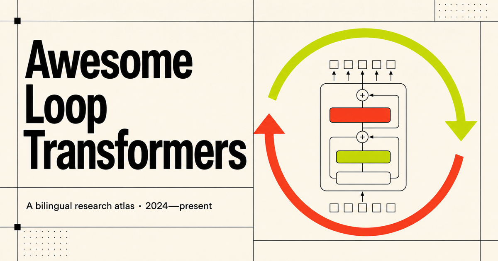

<!-- This file is generated from lib/papers.ts. Edit the data source, then run npm run artifacts. -->
<h1 align="center">Awesome Loop Transformers</h1>

<strong>简体中文</strong>&nbsp;&nbsp;·&nbsp;&nbsp;<a href="README.md">English</a>

<strong>围绕 Loop Transformer 整理的一份双语研究图谱：从循环与递归深度，到潜在推理和测试时计算。</strong>

&nbsp;&nbsp;&nbsp;

<a href="#收录范围"><strong>收录范围</strong></a>&nbsp;&nbsp;·&nbsp;&nbsp;<a href="#综述分类"><strong>综述分类</strong></a>&nbsp;&nbsp;·&nbsp;&nbsp;<a href="#核心必读"><strong>核心必读</strong></a>&nbsp;&nbsp;·&nbsp;&nbsp;<a href="#完整目录"><strong>完整目录</strong></a>&nbsp;&nbsp;·&nbsp;&nbsp;<a href="#参与贡献"><strong>参与贡献</strong></a>

## 一览

| 2024 年至今 | 核心循环路线 | 广义潜在路线 | 完整目录 |
| :---: | :---: | :---: | :---: |
| **137** 篇近期工作 | **111** 篇核心工作 | **26** 篇代表性工作 | **142** 篇（含基础工作） |

最近调研更新: <strong>2026-09-04</strong> · 论文、代码与项目主页一站直达

## 收录范围

主目录关注的是这样一类模型：在一次前向计算中，重复使用同一个 Transformer 层、模块或层栈；同时也收录直接讨论它们的理论、训练、系统和应用工作。**广义潜在推理** 单独成章，其中包括 Coconut、HRM、TRM、隐式 CoT 等代表性工作。它们未必属于 Loop Transformer，但都让模型在隐状态中完成多步计算。这个方向范围很大，因此这里只选有代表性的研究。

## 综述分类

| 方向 | 数量 | 关注问题 |
| --- | :---: | --- |
| **[基础与理论](#基础与理论)** | 20 | 表达能力、可编程性，以及长度与深度泛化。 |
| **[架构与扩展](#架构与扩展)** | 26 | 参数共享、循环核心、MoE、多分辨率设计与扩展规律。 |
| **[潜在推理](#潜在推理)** | 12 | 测试时深度、隐状态中的多步计算，以及潜在 CoT。 |
| **[自适应计算](#自适应计算)** | 11 | Token 级路由、学习式停止、提前退出与预算条件深度。 |
| **[训练与机制分析](#训练与机制分析)** | 23 | 优化、稳定性、收敛、不动点与过度思考。 |
| **[系统与应用](#系统与应用)** | 24 | 推理延迟、KV 内存、并行循环，以及代码、多模态和机器人应用。 |
| **[广义潜在推理](#广义潜在推理)** | 26 | 连续思维、隐式 CoT、层次循环、HRM 与 TRM。 |

## 核心必读

- **[Adaptive Computation Time for Recurrent Neural Networks](https://arxiv.org/abs/1603.08983)** — 提出可微分的停止机制，使循环模型能够针对不同输入动态分配计算步数。
- **[Universal Transformers](https://arxiv.org/abs/1807.03819)** — 奠定深度循环 Transformer 的经典形式：共享变换反复更新各 token，并可结合自适应停止。
- **[Deep Equilibrium Models](https://arxiv.org/abs/1909.01377)** — 把无限深的权重共享网络视为不动点系统，为显式展开循环提供隐式深度的对应框架。
- **[Looped Transformers as Programmable Computers](https://proceedings.mlr.press/v202/giannou23a.html)** — 构造可在循环中执行迭代程序的常数规模 Transformer 块，明确展示循环深度的计算能力。
- **[Looped Transformers are Better at Learning Learning Algorithms](https://openreview.net/forum?id=HHbRxoDTxE)** — 表明小型共享 Transformer 经多次循环后可以学习迭代式上下文拟合算法，并显著减少参数量。
- **[Scaling up Test-Time Compute with Latent Reasoning: A Recurrent Depth Approach](https://arxiv.org/abs/2502.05171)** — 把循环深度扩展到 35 亿参数、8000 亿 token 的语言模型，并显示增加测试时循环可在不生成更多 token 的情况下增强推理。
- **[Scaling Latent Reasoning via Looped Language Models](https://arxiv.org/abs/2510.25741)** — 提出 Ouro 预训练循环语言模型，以熵正则进行深度分配，并把循环深度作为独立的扩展维度研究。
- **[Training Large Language Models to Reason in a Continuous Latent Space](https://arxiv.org/abs/2412.06769)** — Coconut 把生成的隐藏状态直接作为下一步输入嵌入，形成可同时承载多个候选路径的连续思维链。
- **[Hierarchical Reasoning Model](https://arxiv.org/abs/2506.21734)** — 使用工作在不同时间尺度的两个循环模块，以紧凑的非 Transformer 推理器解决高难符号任务。
- **[Less is More: Recursive Reasoning with Tiny Networks](https://arxiv.org/abs/2510.04871)** — 提出 Tiny Recursive Model：不依赖 Transformer 主干，用极小循环网络反复改进结构化推理问题的答案。

## 完整目录

### 基础与理论

<strong>2026</strong> · 4 篇

- **When Does Recurrence Become an Algorithm? Convergence Selection in Weight-Tied Looped Transformers** — Tong Zhang et al.. *arXiv 2026*. 
  用受控群字问题研究权重共享与训练预算如何选择串行计算前沿，并提出收敛时间扩展作为机制诊断工具。 
  [论文](https://arxiv.org/abs/2607.20594)

- **Looped Transformers with Layer Normalization Provably Learn the Power Method** — Lyumin Wu, Chenyang Zhang, Yuan Cao. *arXiv 2026*. 
  证明梯度下降会选择一种带 LayerNorm 的循环解，使每次注意力调用对应一次幂迭代。 
  [论文](https://arxiv.org/abs/2606.00605)

- **Chain-of-Thought and Compressed Looped Transformers: A Memory-Budget Separation** — Haozhou Zhang. *arXiv 2026*. 
  形式化说明记忆容量分离：增加循环次数不会让压缩潜在循环获得多项式长度思维链所拥有的增长式草稿空间。 
  [论文](https://arxiv.org/abs/2605.30757)

- **Stability and Generalization in Looped Transformers** — Asher Labovich. *arXiv 2026*. 
  刻画回忆连接与归一化如何影响可达、依赖输入的不动点及深度泛化。 
  [论文](https://arxiv.org/abs/2604.15259) · [代码](https://github.com/ashlab11/generalization)

<strong>2025</strong> · 4 篇

- **To CoT or To Loop? A Formal Comparison Between Chain-of-Thought and Looped Transformers** — Kevin Xu, Issei Sato. *arXiv 2025*. 
  形式化区分两种计算扩展方式：循环更擅长并行确定性计算，而随机 CoT 在部分自归约问题上更有优势。 
  [论文](https://arxiv.org/abs/2505.19245)

- **A Little Depth Goes a Long Way: The Expressive Power of Log-Depth Transformers** — William Merrill, Ashish Sabharwal. *ICLR 2025*. 
  证明共享模块只需随输入长度对数级展开，就能识别正则语言并解决超出固定深度能力边界的图连通问题。 
  [论文](https://openreview.net/forum?id=njycONK0JG)

- **Transformers Learn to Implement Multi-step Gradient Descent with Chain of Thought** — Jianhao Huang, Zixuan Wang, Jason D. Lee. *arXiv 2025*. 
  分析 CoT 训练如何诱导多步上下文梯度下降，并用同一套理论工具说明循环带来的性能提升。 
  [论文](https://arxiv.org/abs/2502.21212)

- **Neural Algorithmic Reasoning for Hypergraphs with Looped Transformers** — Zekai Huang et al.. *arXiv 2025*. 
  通过图退化与超边感知编码，把循环 Transformer 的构造性算法模拟从图扩展到超图，包括 Dijkstra 与 Helly 等算法。 
  [论文](https://arxiv.org/abs/2501.10688)

<strong>2024</strong> · 7 篇

- **On the Role of Depth and Looping for In-Context Learning with Task Diversity** — Khashayar Gatmiry et al.. *arXiv 2024*. 
  建立多样化上下文回归任务的深度需求，并说明权重共享循环在保持表达力的同时，可改善分布偏移鲁棒性和随深度变化的单调性。 
  [论文](https://arxiv.org/abs/2410.21698)

- **Bypassing the Exponential Dependency: Looped Transformers Efficiently Learn In-context by Multi-step Gradient Descent** — Bo Chen et al.. *arXiv 2024*. 
  证明线性循环 Transformer 能用多步梯度下降完成上下文学习，而不需要指数数量的示例。 
  [论文](https://arxiv.org/abs/2410.11268)

- **Looped ReLU MLPs May Be All You Need as Practical Programmable Computers** — Yingyu Liang et al.. *arXiv 2024*. 
  证明紧凑的循环 ReLU MLP 可实现可编程计算机的基本操作，为循环 Transformer 的表达能力提供非注意力架构参照。 
  [论文](https://arxiv.org/abs/2410.09375)

- **Can Looped Transformers Learn to Implement Multi-step Gradient Descent for In-context Learning?** — Khashayar Gatmiry et al.. *arXiv 2024*. 
  从可表达性推进到可学习性分析：总体风险最优解与梯度流会学习适应数据分布的多步预条件梯度法。 
  [论文](https://arxiv.org/abs/2410.08292)

- **On Expressive Power of Looped Transformers: Theoretical Analysis and Enhancement via Timestep Encoding** — Kevin Xu, Issei Sato. *ICML 2025*. 
  推导循环 Transformer 的逼近保证与特有瓶颈，并用时间步条件调制让共享块在不同循环中产生差异化行为。 
  [论文](https://proceedings.mlr.press/v267/xu25x.html) · [代码](https://github.com/kevin671/tmlt)

- **Looped Transformers for Length Generalization** — Ying Fan et al.. *ICLR 2025*. 
  训练解码器式循环 Transformer 让循环次数随问题长度变化，从而在迭代算法任务上获得更强的长度外推。 
  [论文](https://openreview.net/forum?id=2edigk8yoU) · [代码](https://github.com/UW-Madison-Lee-Lab/looped-tf)

- **Simulation of Graph Algorithms with Looped Transformers** — Artur Back de Luca, Kimon Fountoulakis. *arXiv 2024*. 
  构造可在任意规模图上执行最短路、遍历和连通性算法的循环 Transformer，并明确讨论有限精度带来的限制。 
  [论文](https://arxiv.org/abs/2402.01107) · [代码](https://github.com/watcl-lab/graphalgosimulation)

<strong>2023</strong> · 2 篇

- **Looped Transformers are Better at Learning Learning Algorithms** — Liu Yang et al.. *ICLR 2024*. 
  表明小型共享 Transformer 经多次循环后可以学习迭代式上下文拟合算法，并显著减少参数量。 
  [论文](https://openreview.net/forum?id=HHbRxoDTxE) · [代码](https://github.com/Leiay/looped_transformer)

- **Looped Transformers as Programmable Computers** — Angeliki Giannou et al.. *ICML 2023*. 
  构造可在循环中执行迭代程序的常数规模 Transformer 块，明确展示循环深度的计算能力。 
  [论文](https://proceedings.mlr.press/v202/giannou23a.html) · [代码](https://github.com/jysohn1108/Looped-Transformer)

<strong>2019</strong> · 1 篇

- **Deep Equilibrium Models** — Shaojie Bai, J. Zico Kolter, Vladlen Koltun. *NeurIPS 2019*. 
  把无限深的权重共享网络视为不动点系统，为显式展开循环提供隐式深度的对应框架。 
  [论文](https://arxiv.org/abs/1909.01377) · [代码](https://github.com/locuslab/deq)

<strong>2018</strong> · 1 篇

- **Universal Transformers** — Mostafa Dehghani et al.. *ICLR 2019*. 
  奠定深度循环 Transformer 的经典形式：共享变换反复更新各 token，并可结合自适应停止。 
  [论文](https://arxiv.org/abs/1807.03819) · [代码](https://github.com/tensorflow/tensor2tensor)

<strong>2016</strong> · 1 篇

- **Adaptive Computation Time for Recurrent Neural Networks** — Alex Graves. *arXiv 2016*. 
  提出可微分的停止机制，使循环模型能够针对不同输入动态分配计算步数。 
  [论文](https://arxiv.org/abs/1603.08983)

### 架构与扩展

<strong>2026</strong> · 19 篇

- **SMELT: Scaling Laws for Compute-Matched MoE Looped Transformers** — Shaowen Wang et al.. *arXiv 2026*. 
  在同时匹配 FLOPs、非嵌入参数量和 KV 缓存的条件下评估循环 MoE，区分架构收益与额外计算收益。 
  [论文](https://arxiv.org/abs/2609.01343)

- **Squeezing More from Limited Data with Recursive Transformers** — Serdar Gülbahar et al.. *arXiv 2026*. 
  研究预训练数据稀缺时的递归权重共享，并结合因式分解嵌入，在不盲目扩大参数容量的情况下增加计算。 
  [论文](https://arxiv.org/abs/2608.26973)

- **Allocating Recurrent Compute in Looped Language Models** — Ruhai Lin et al.. *arXiv 2026*. 
  追问究竟哪些子层应循环，发现只重复序列混合器可保留大量循环收益，而无需每轮都执行 FFN。 
  [论文](https://arxiv.org/abs/2608.18230)

- **Gated Recurrent Transformers: Expressive Depth through Recurrent Modulation** — Amr Hegazy et al.. *arXiv 2026*. 
  用学习到的更新门和逐步噪声调制共享循环核心，使同一模块在不同循环中形成专门化。 
  [论文](https://arxiv.org/abs/2608.15062)

- **Looped Transformers with Source-Centered State Evolution** — Bum Jun Kim et al.. *arXiv 2026*. 
  围绕学习到的输入条件锚点定义循环，使零偏差严格不变，从而消除重复加性输入注入产生的强迫偏置。 
  [论文](https://arxiv.org/abs/2607.27656)

- **Mobius Learning: Cyclic Depth Folding in Transformers** — Tongtian Zhu. *arXiv 2026*. 
  在不同数据流间轮换模块顺序，使每个共享模块组同时学习浅层与深层角色，探索超越固定循环顺序的环形深度折叠。 
  [论文](https://arxiv.org/abs/2607.17843)

- **Loop the Loopies!** — Zitian Gao et al.. *arXiv 2026*. 
  提出大规模循环 MoE 配方，把参数内存节省重新投入训练，并与计算匹配的稀疏基线比较。 
  [论文](https://arxiv.org/abs/2607.16051)

- **LoopMoE: Unifying Iterative Computation with Mixture-of-Experts for Language Modeling** — Wenkai Chen et al.. *arXiv 2026*. 
  把共享计算的重复迭代与稀疏专家路由结合，同时追求迭代细化与可扩展参数容量。 
  [论文](https://arxiv.org/abs/2606.04438)

- **CART: Context-Anchored Recurrent Transformer -- A Parameter-Efficient Architecture with Learned Stability** — Chad A. Capps. *arXiv 2026*. 
  让循环核心在学习式稳定门控下交叉注意固定上下文的键值，并通过受控实验记录该方案未能击败稠密基线或进行深度外推的情形。 
  [论文](https://arxiv.org/abs/2606.01495)

- **A Dual-Path Architecture for Scaling Compute and Capacity in LLMs** — Markus Frey et al.. *arXiv 2026*. 
  将反复执行的深路径与单次执行的宽前馈路径并列，让 token 级门控在迭代计算与单步参数容量间分配资源。 
  [论文](https://arxiv.org/abs/2605.30202)

- **Latent Recurrent Transformer: Architecture Exploration, Training Strategies, and Scaling Behavior** — Zeyi Huang et al.. *arXiv 2026*. 
  把前一 token 的高层隐藏状态传递到下一 token，同时保留标准 KV-cache 接口，并提出交错并行训练处理跨 token 循环。 
  [论文](https://arxiv.org/abs/2605.26797)

- **LoopUS: Recasting Pretrained LLMs into Looped Latent Refinement Models** — Taekhyun Park et al.. *arXiv 2026*. 
  把现有预训练大模型改造成循环隐空间细化模型，避免完全从头训练循环深度。 
  [论文](https://arxiv.org/abs/2605.11011) · [代码](https://github.com/Thrillcrazyer/LoopUS) · [主页](https://thrillcrazyer.github.io/LoopUS)

- **Sparse Layers are Critical to Scaling Looped Language Models** — Ryan Lee et al.. *arXiv 2026*. 
  发现稀疏容量对循环语言模型扩展尤为关键，可改善质量—内存权衡及提前退出表现。 
  [论文](https://arxiv.org/abs/2605.09165)

- **Hyperloop Transformers** — Abbas Zeitoun et al.. *arXiv 2026*. 
  只循环中间层块，并在各次访问之间加入 Hyper-Connections，面向模型内存受限与量化场景提升语言建模效率。 
  [论文](https://arxiv.org/abs/2604.21254)

- **How Much Is One Recurrence Worth? Iso-Depth Scaling Laws for Looped Language Models** — Kristian Schwethelm et al.. *arXiv 2026*. 
  在匹配有效深度与训练计算的条件下，量化重复层相对于独立层的性能价值。 
  [论文](https://arxiv.org/abs/2604.21106) · [代码](https://github.com/kschwethelm/looped-lm-scaling)

- **Ouroboros: Dynamic Weight Generation for Recursive Transformers via Input-Conditioned LoRA Modulation** — Jaber Jaber, Osama Jaber. *arXiv 2026*. 
  用紧凑控制器在共享 LoRA 基底上生成输入与步数条件调制，使递归模块每次访问时具有不同的有效变换。 
  [论文](https://arxiv.org/abs/2604.02051) · [代码](https://github.com/RightNow-AI/ouroboros)

- **Adaptive Loops and Memory in Transformers: Think Harder or Know More?** — Markus Frey et al.. *arXiv 2026*. 
  结合逐层自适应循环与门控记忆库，将额外迭代计算和额外学习存储分离，并揭示二者在不同任务上的作用差异。 
  [论文](https://arxiv.org/abs/2603.08391)

- **SpiralFormer: Looped Transformers Can Learn Hierarchical Dependencies via Multi-Resolution Recursion** — Chengting Yu et al.. *arXiv 2026*. 
  在多种序列分辨率上执行递归，把分辨率变成高效层次计算的新维度。 
  [论文](https://arxiv.org/abs/2602.11698)

- **Depth-Recurrent Attention Mixtures: Giving Latent Reasoning the Attention it Deserves** — Jonas Knupp et al.. *arXiv 2026*. 
  在保留循环核心的同时，为不同重复深度提供更丰富的注意力变换。 
  [论文](https://arxiv.org/abs/2601.21582)

<strong>2025</strong> · 4 篇

- **Improving Recursive Transformers with Mixture of LoRAs** — Mohammadmahdi Nouriborji et al.. *arXiv 2025*. 
  在共享前馈网络中加入 token 条件化的 LoRA 专家，补回递归权重共享所损失的部分逐层表达能力。 
  [论文](https://arxiv.org/abs/2512.12880)

- **Teaching Pretrained Language Models to Think Deeper with Retrofitted Recurrence** — Sean McLeish et al.. *arXiv 2025*. 
  通过继续训练把稠密预训练模型改造成循环深度模型，检验能否在预训练后补装循环推理能力。 
  [论文](https://arxiv.org/abs/2511.07384) · [代码](https://github.com/mcleish7/retrofitting-recurrence)

- **MeSH: Memory-as-State-Highways for Recursive Transformers** — Chengting Yu et al.. *arXiv 2025*. 
  引入显式记忆缓冲区和轻量路由器，分离长期与瞬时状态，并促使不同递归步形成差异化计算。 
  [论文](https://arxiv.org/abs/2510.07739) · [代码](https://github.com/LivingFutureLab/MeSH)

- **Two-Scale Latent Dynamics for Recurrent-Depth Transformers** — Francesco Pappone et al.. *arXiv 2025*. 
  引入快慢两种隐状态动力学，让循环深度模型分离局部细化与长程状态演化。 
  [论文](https://arxiv.org/abs/2509.23314)

<strong>2024</strong> · 3 篇

- **Relaxed Recursive Transformers: Effective Parameter Sharing with Layer-wise LoRA** — Sangmin Bae et al.. *ICLR 2025*. 
  把预训练 Transformer 折叠为重复块，再用轻量 LoRA 恢复层间差异，并提出连续深度批处理的设想。 
  [论文](https://openreview.net/forum?id=WwpYSOkkCt)

- **MoEUT: Mixture-of-Experts Universal Transformers** — Róbert Csordás et al.. *NeurIPS 2024*. 
  在 Universal Transformer 中加入稀疏专家与改进的循环机制，缩小其与常规语言模型的性能差距。 
  [论文](https://proceedings.neurips.cc/paper_files/paper/2024/hash/321387ba926b8e58d3591c0aeb52ffc2-Abstract-Conference.html) · [代码](https://github.com/robertcsordas/moeut)

- **AlgoFormer: An Efficient Transformer Framework with Algorithmic Structures** — Yihang Gao et al.. *TMLR 2025*. 
  用任务相关的前后处理模块包围可复用的中间循环块，把迭代算法先验注入 Transformer。 
  [论文](https://openreview.net/forum?id=oYP2Pd5aQt) · [代码](https://github.com/chuanyang-Zheng/Algoformer)

### 潜在推理

<strong>2026</strong> · 7 篇

- **Penelope: Localized Latent Recurrence for Efficient Structured Reasoning** — Yutong Chen et al.. *arXiv 2026*. 
  把循环细化限制在由缓存前缀锚定的解码器中间区间，避免为潜在推理反复执行完整模型。 
  [论文](https://arxiv.org/abs/2607.25915)

- **T^2MLR: Transformer with Temporal Middle-Layer Recurrence** — Ziyang Cai et al.. *arXiv 2026*. 
  把前一 token 的中层表示送入当前 token 的更早层，以局部循环在解码步之间保留潜在计算。 
  [论文](https://arxiv.org/abs/2607.15178)

- **DiscoLoop: Looping Discrete Embeddings and Continuous Hidden States for Multi-hop Reasoning** — Hengyu Fu et al.. *arXiv 2026*. 
  在循环中同时传递离散嵌入与连续隐藏状态通道，缓解可解码桥接实体与 token 对齐表示之间的落差。 
  [论文](https://arxiv.org/abs/2607.00341)

- **Bridging the Gap Between Latent and Explicit Reasoning with Looped Transformers** — Ying Fan, Anej Svete, Kangwook Lee. *arXiv 2026*. 
  LOTUS 用显式推理步骤并行监督潜变量，使循环隐推理更接近 CoT 质量，同时降低思考阶段延迟。 
  [论文](https://arxiv.org/abs/2606.31779)

- **Solve the Loop: Attractor Models for Language and Reasoning** — Jacob Fein-Ashley, Paria Rashidinejad. *arXiv 2026*. 
  用求解至收敛的吸引子模块取代固定展开，并通过隐式微分训练，实现训练内存恒定的自适应有效深度。 
  [论文](https://arxiv.org/abs/2605.12466)

- **Latent Chain-of-Thought Improves Structured-Data Transformers** — Carson Dudley, Samet Oymak. *arXiv 2026*. 
  把查询位置的压缩状态作为额外 token 反馈给模型反复处理，将潜在测试时计算扩展到表格预测与时间序列预测。 
  [论文](https://arxiv.org/abs/2605.11262)

- **Thinking Deeper, Not Longer: Depth-Recurrent Transformers for Compositional Generalization** — Hung-Hsuan Chen. *arXiv 2026*. 
  检验循环隐空间深度能否比更长的显式推理文本更好地提升分布外系统组合能力。 
  [论文](https://arxiv.org/abs/2603.21676)

<strong>2025</strong> · 5 篇

- **Closed-Loop Transformers: Autoregressive Modeling as Iterative Latent Equilibrium** — Akbar Anbar Jafari, Gholamreza Anbarjafari. *arXiv 2025*. 
  在生成每个 token 前，把潜在状态迭代细化到学习到的能量平衡点，将自回归预测重述为闭环纠错过程。 
  [论文](https://arxiv.org/abs/2511.21882)

- **Scaling Latent Reasoning via Looped Language Models** — Rui-Jie Zhu et al.. *arXiv 2025*. 
  提出 Ouro 预训练循环语言模型，以熵正则进行深度分配，并把循环深度作为独立的扩展维度研究。 
  [论文](https://arxiv.org/abs/2510.25741) · [主页](https://ouro-llm.github.io/)

- **Reasoning with Latent Thoughts: On the Power of Looped Transformers** — Nikunj Saunshi et al.. *ICLR 2025*. 
  从理论与实验上连接循环和隐空间多步推理，指出有效计算深度可能比独立参数层数更关键。 
  [论文](https://openreview.net/forum?id=din0lGfZFd)

- **Enhancing Auto-regressive Chain-of-Thought through Loop-Aligned Reasoning** — Qifan Yu et al.. *arXiv 2025*. 
  RELAY 将显式推理步骤与循环迭代对齐，通过中间监督生成可进行长度外推的推理链，再用于增强自回归模型。 
  [论文](https://arxiv.org/abs/2502.08482) · [代码](https://github.com/qifanyu/RELAY)

- **Scaling up Test-Time Compute with Latent Reasoning: A Recurrent Depth Approach** — Jonas Geiping et al.. *NeurIPS 2025*. 
  把循环深度扩展到 35 亿参数、8000 亿 token 的语言模型，并显示增加测试时循环可在不生成更多 token 的情况下增强推理。 
  [论文](https://arxiv.org/abs/2502.05171) · [代码](https://github.com/seal-rg/recurrent-pretraining) · [主页](https://huggingface.co/tomg-group-umd/huginn-0125)

### 自适应计算

<strong>2026</strong> · 8 篇

- **RecurTrace: Adaptive Latent Reasoning with Loop-Time Memory** — Yuxiang Wang et al.. *arXiv 2026*. 
  让每个重复层关注自身此前各循环状态，并用损失改善监督训练停止头，把循环时间记忆与输入自适应深度结合起来。 
  [论文](https://arxiv.org/abs/2609.03379)

- **Per-Token Fixed-Point Convergence in Depth-Recurrent Transformers** — Joe Logan. *arXiv 2026*. 
  测量不同 token 的收敛深度，并显示在所研究规模上，免训练的稳定性规则可比学习式路由器更早停止已收敛 token。 
  [论文](https://arxiv.org/abs/2607.14427)

- **Adaptive Depth in Looped Transformers: Diagnosing Learned Halting Gates and Trajectory Readouts** — Andrei Cristian Popescu et al.. *arXiv 2026*. 
  区分循环轨迹形成与出口读出，并发现当轨迹独立塑形时，简单的事后置信度规则可与学习式停止门相当。 
  [论文](https://arxiv.org/abs/2607.20519)

- **Stabilizing Extrapolation in Looped Transformers via Learned Stochastic Stopping** — Hsun-Yu Kuo et al.. *arXiv 2026*. 
  随机化训练监督的停止深度并学习何时停止，降低长度泛化对单一训练循环数的敏感性。 
  [论文](https://arxiv.org/abs/2606.29983)

- **Fixed-Point Reasoners: Stable and Adaptive Deep Looped Transformers** — Sajad Movahedi et al.. *arXiv 2026*. 
  围绕稳定吸引子训练深循环 Transformer，使推理可依据收敛而非固定迭代次数停止。 
  [论文](https://arxiv.org/abs/2606.18206) · [代码](https://github.com/nilskiKonjIzDunava/fprm)

- **Skip a Layer or Loop It? Learning Program-of-Layers in LLMs** — Ziyue Li, Yang Li, Tianyi Zhou. *ICML 2026*. 
  学习由输入条件决定的层程序，可在预训练 Transformer 层栈中顺序执行、跳过或回访模块。 
  [论文](https://arxiv.org/abs/2606.06574) · [代码](https://github.com/tianyi-lab/PoLar)

- **AdaPonderLM: Gated Pondering Language Models with Token-Wise Adaptive Depth** — Shixiang Song et al.. *arXiv 2026*. 
  学习 token 级思考门控，使共享语言模型块能让简单 token 提前停止、困难 token 继续细化。 
  [论文](https://arxiv.org/abs/2603.01914)

- **LoopFormer: Elastic-Depth Looped Transformers for Latent Reasoning via Shortcut Modulation** — Ahmadreza Jeddi et al.. *ICLR 2026*. 
  约束不同长度的循环轨迹保持一致，使同一模型能在多种推理预算下平滑工作。 
  [论文](https://openreview.net/forum?id=RzYXb5YWBs) · [代码](https://github.com/armenjeddi/loopformer) · [主页](https://loopformer.github.io/)

<strong>2025</strong> · 3 篇

- **Think-at-Hard: Selective Latent Iterations to Improve Reasoning Language Models** — Tianyu Fu et al.. *ICML 2026*. 
  分析 Ouro 的额外循环在何处有效，并把循环计算选择性投入更困难的 token 或推理阶段。 
  [论文](https://openreview.net/forum?id=eQaJSRZiGn) · [代码](https://github.com/thu-nics/TaH)

- **Mixture-of-Recursions: Learning Dynamic Recursive Depths for Adaptive Token-Level Computation** — Sangmin Bae et al.. *NeurIPS 2025*. 
  在共享 Transformer 层栈中为每个 token 学习递归深度，把参数复用与 token 级稀疏计算结合起来。 
  [论文](https://arxiv.org/abs/2507.10524) · [代码](https://github.com/raymin0223/mixture_of_recursions)

- **Skip a Layer or Loop it? Test-Time Depth Adaptation of Pretrained LLMs** — Ziyue Li, Yang Li, Tianyi Zhou. *arXiv 2025*. 
  研究预训练大模型在推理时跳过或重复层，把既有层栈视为可调整的深度程序而非固定路径。 
  [论文](https://arxiv.org/abs/2507.07996)

### 训练与机制分析

<strong>2026</strong> · 21 篇

- **Looped Transformers under the Jacobian Lens: Does the Global Workspace Survive Recurrence?** — Wenlong Wang, Fergal Reid. *arXiv 2026*. 
  把 Jacobian Lens 干预扩展到 Ouro 与 Huginn 的虚拟展开，发现二者都形成类似全局工作空间的表示，但跨循环传递与暴露方式不同。 
  [论文](https://arxiv.org/abs/2609.01924)

- **Dynamical phase selection controls compute scaling in looped transformers** — Gunn Kim. *arXiv 2026*. 
  说明相同架构与目标的循环模型可能落入不同分岔相，其松弛动力学会决定测试时计算扩展行为。 
  [论文](https://arxiv.org/abs/2608.26556)

- **Think Shallow, Solve Deep: Controlling Recurrent Dynamics for Reliable Test-Time Depth** — Ivan Viakhirev et al.. *arXiv 2026*. 
  分类循环动力学，并引入终端不动点目标，使额外测试时深度更安全可靠。 
  [论文](https://arxiv.org/abs/2608.18222)

- **LoopMTP: A Looped Transformer Guided by Latent Multi-Token Prediction** — Behzad Shomali et al.. *arXiv 2026*. 
  让每轮状态对齐更远的未来 token，以密集监督减少无方向的隐状态细化与过度思考。 
  [论文](https://arxiv.org/abs/2608.03624)

- **Operational Proto-Introspection in Looped Language Models: Process-Quality Taps, Executable Branching, and the Readout-Control Boundary** — Jan Kirin. *arXiv 2026*. 
  检验 Ouro 与 Huginn 状态能否反映当前解题质量，发现其读出可支持决策，但直接生成式操控未能可靠转化为收益。 
  [论文](https://arxiv.org/abs/2607.18553)

- **DeepLoop: Depth Scaling for Looped Transformers** — Shuzhen Li et al.. *arXiv 2026*. 
  依据共享参数被访问的次数推导残差初始化规则，稳定深度展开的 Post-LN 循环 Transformer。 
  [论文](https://arxiv.org/abs/2607.13491) · [代码](https://github.com/lszshu/DeepLoop)

- **LayerNorm as Implicit Gain Control in Looped Transformers** — Matthias M. M. Buehlmaier. *arXiv 2026*. 
  把 Pre-LayerNorm 分析为循环动力学的隐式增益控制器，区分谱稳定性与算子范数界，也区分稳定作用与记忆作用。 
  [论文](https://arxiv.org/abs/2607.10681)

- **Repeated Shared Access Enables Grokking, but Edit Propagation Depends on an Addressable Memory** — Yanan Niu. *arXiv 2026*. 
  在受控实验中分离循环与共享记忆访问：二者都可能促进 grokking，但可靠的多跳编辑传播取决于可寻址记忆，而非循环本身。 
  [论文](https://arxiv.org/abs/2606.20737)

- **On the Residual Scaling of Looped Transformers: Stability and Transferability** — Shaowen Wang et al.. *arXiv 2026*. 
  指出权重重复造成的相关更新会改变残差增长规律，并推导支持稳定深度与超参数迁移的循环感知缩放。 
  [论文](https://arxiv.org/abs/2606.18524)

- **Dense Supervision Is Not Enough: The Readout Blind Spot in Looped Language Models** — Rituraj Sharma, Tu Vu. *arXiv 2026*. 
  说明逐循环交叉熵虽能训练可用出口，但归一化读出会遮蔽径向尺度，使循环状态规模失控，因此需要显式尺度约束。 
  [论文](https://arxiv.org/abs/2606.24898)

- **Stabilizing Recurrent Dynamics for Test-Time Scalable Latent Reasoning in Looped Language Models** — Xiao-Wen Yang et al.. *ICML 2026*. 
  在训练中采样循环深度并正则化循环 Jacobian，目标是在推理循环超过训练范围时仍能稳定提升。 
  [论文](https://arxiv.org/abs/2605.26733) · [代码](https://github.com/njuyxw/STARS)

- **Simply Stabilizing the Loop via Fully Looped Transformer** — Rao Fu et al.. *arXiv 2026*. 
  研究全循环架构与简化稳定方案，旨在规避部分循环设计中的脆弱动力学。 
  [论文](https://arxiv.org/abs/2605.18797) · [代码](https://github.com/FuRuF-11/FullyLoopedTransformer)

- **Parcae: Scaling Laws For Stable Looped Language Models** — Hayden Prairie et al.. *ICLR 2026 LIT Workshop*. 
  从循环动力系统角度诊断残差不稳定，并约束注入算子以获得更可预测的训练和测试时扩展。 
  [论文](https://arxiv.org/abs/2604.12946)

- **A Mechanistic Analysis of Looped Reasoning Language Models** — Hugh Blayney et al.. *arXiv 2026*. 
  跟踪 Ouro、Huginn 等模型的循环表示，识别反复出现的推理阶段与收敛模式。 
  [论文](https://arxiv.org/abs/2604.11791)

- **Relational Preference Encoding in Looped Transformer Internal States** — Jan Kirin. *arXiv 2026*. 
  研究 Ouro 各循环步中的偏好读出；追加审计撤回了被高估的主要结果，但保留了较小的关系式优于逐点式解码效应及重要评估警示。 
  [论文](https://arxiv.org/abs/2604.09870)

- **LoopRPT: Reinforcement Pre-Training for Looped Language Models** — Guo Tang et al.. *arXiv 2026*. 
  在预训练阶段把强化信号直接施加到中间潜在步骤，使 Ouro 式模型更早形成高质量的困难 token 表示。 
  [论文](https://arxiv.org/abs/2603.19714)

- **Prioritize the Process, Not Just the Outcome: Rewarding Latent Thought Trajectories Improves Reasoning in Looped Language Models** — Jonathan Williams, Esin Tureci. *arXiv 2026*. 
  RLTT 将强化学习信用分配到 Ouro 的完整潜在轨迹，而不只奖励最后一个循环状态，从而直接训练隐式推理过程。 
  [论文](https://arxiv.org/abs/2602.10520) · [代码](https://github.com/jonwill8/RLTT)

- **Step-resolved data attribution for looped transformers** — Georgios Kaissis et al.. *arXiv 2026*. 
  把训练样本影响分解到各个循环步，并用 TensorSketch 在不显式保存逐样本完整梯度的情况下实现逐步归因。 
  [论文](https://arxiv.org/abs/2602.10097)

- **Understanding Dynamic Compute Allocation in Recurrent Transformers** — Ibraheem Muhammad Moosa et al.. *arXiv 2026*. 
  用受控算法任务衡量 token 级动态深度是否对应难度，以及路由策略能否外推。 
  [论文](https://arxiv.org/abs/2602.08864)

- **Loop as a Bridge: Can Looped Transformers Truly Link Representation Space and Natural Language Outputs?** — Guanxu Chen et al.. *arXiv 2026*. 
  检验额外循环能否改善内部知识的表达，发现部分表面增益来自表示退化，从而揭示现有循环模型的内省局限。 
  [论文](https://arxiv.org/abs/2601.10242)

- **Energy-Entropy Regularization: The True Power of Minimal Looped Transformers** — Wai-Lun Lam. *arXiv 2026*. 
  利用 Tsallis 熵与受 Hamilton 动力学启发的优化方法，训练极小的单头循环 Transformer 完成长程归纳任务。 
  [论文](https://arxiv.org/abs/2601.09588)

<strong>2025</strong> · 2 篇

- **What Makes Looped Transformers Perform Better Than Non-Recursive Ones (Provably)** — Zixuan Gong et al.. *arXiv 2025*. 
  从损失景观几何解释循环注意力的优化优势，并据此提出分阶段训练方法。 
  [论文](https://arxiv.org/abs/2510.10089)

- **Latent Chain-of-Thought? Decoding the Depth-Recurrent Transformer** — Wenquan Lu et al.. *COLM 2025 Workshop*. 
  沿 Huginn 的循环步探测隐藏状态，检验其轨迹是否形成可解码的潜在思维链。 
  [论文](https://openreview.net/forum?id=roIQdXMuEj) · [代码](https://github.com/wenquanlu/huginn-latent-cot)

### 系统与应用

<strong>2026</strong> · 23 篇

- **Recirculation** — Michael C. Mozer et al.. *arXiv 2026*. 
  在冻结基础模型的预填充阶段加入一种不同于常规深度循环的递归，改善信念状态跟踪且不增加生成阶段延迟。 
  [论文](https://arxiv.org/abs/2608.17981)

- **Looped Language Models Improve Compositional Tool Calling** — Andrei Cristian Popescu et al.. *arXiv 2026*. 
  在工具调用任务上评估循环深度，发现其收益主要出现在具有组合或依赖结构的调用中。 
  [论文](https://arxiv.org/abs/2608.18171)

- **Nanbeige4.2-3B on Apple Silicon: Fixing Deployment Bugs and Decreasing Looped Transformer Memory Overhead** — John T. Halloran. *arXiv 2026*. 
  审计循环 Agent 模型在 Apple Silicon 上的实际部署故障，并用分块预填充降低第二次层栈执行带来的峰值注意力内存开销。 
  [论文](https://arxiv.org/abs/2608.13987) · [代码](https://github.com/johnhalloran321/Nanbeige4.2-3B-mps-fix)

- **MergeOver: Post-Training Token Merging for Recursive Vision Transformers** — Junseo Kim et al.. *arXiv 2026*. 
  在递归权重共享视觉 Transformer 中加入免重训的 token 合并，并跨重复阶段维护空间反合并约束。 
  [论文](https://arxiv.org/abs/2608.13141)

- **Depth-Adaptive Inference of Looped Language Models via Continuous Depth Batching** — Kristian Schwethelm et al.. *arXiv 2026*. 
  把可变循环深度变成服务系统原语，持续批处理在不同循环次数进入和退出的样本。 
  [论文](https://arxiv.org/abs/2608.09444)

- **bioMoR: Biology-Guided Mixture-of-Recursions for Effective Genomic Learning** — Koushik Howlader et al.. *arXiv 2026*. 
  把生物图知识注入 token 嵌入、注意力偏置与递归路由器，依据结构知识为基因和通路分配更深计算。 
  [论文](https://arxiv.org/abs/2608.06727)

- **Nanbeige4.2-3B: Unlocking Agentic Capabilities in a Compact Model** — Nanbeige Lab et al.. *arXiv 2026*. 
  基于复用层栈的循环 Transformer 预训练紧凑型 3B Agent 模型，并结合大规模 Agent 后训练流程。 
  [论文](https://arxiv.org/abs/2607.22083)

- **Looped Latent Attention: Cross-Loop KV Compression for Looped Transformers** — James O'Neill, Fergal Reid. *arXiv 2026*. 
  把不同循环中的 K/V 轨迹压缩到紧凑隐表示中，以提高循环模型的服务容量。 
  [论文](https://arxiv.org/abs/2607.15456)

- **LoopCoder: Scaling Code Intelligence via Looped Language Models** — Jian Yang et al.. *Findings of ACL 2026*. 
  把循环式预训练与后训练扩展到总参数 400 亿、激活参数 80 亿的代码模型，并用稠密到循环初始化增强稳定性。 
  [论文](https://aclanthology.org/2026.findings-acl.796/) · [代码](https://github.com/CSJianYang/LoopCoder)

- **Soft Mixture-of-Recursions: Going Deeper with Recursive Vision Transformers** — Sang In Lee, Jihun Park. *arXiv 2026*. 
  对所有递归步输出学习 token 级软混合，使递归视觉 Transformer 能利用中间状态，而非只读取最后一次访问。 
  [论文](https://arxiv.org/abs/2607.00774)

- **LoopCoder-v2: Only Loop Once for Efficient Test-Time Computation Scaling** — Jian Yang et al.. *arXiv 2026*. 
  在 70 亿规模比较并行循环次数，发现收益并不单调：一次重复已获得主要提升，更多循环会受位置错配影响。 
  [论文](https://arxiv.org/abs/2606.18023) · [代码](https://github.com/CSJianYang/LoopCoder)

- **Rethinking Depth: A study of the Recursive-Transformer for Speech Recognition** — Thomas Rolland et al.. *arXiv 2026*. 
  系统研究语音编码器应在何处、以多大深度递归，发现有限循环可在显著减少独立参数的同时保持有竞争力的识别效果。 
  [论文](https://arxiv.org/abs/2606.09357)

- **Test-Time Compute Scaling for ASR with Depth-Conditioned Looped Transformers** — Yacouba Kaloga et al.. *arXiv 2026*. 
  通过稀疏 CTC 检查点、深度条件调制和延迟后验反馈，把循环编码器深度变成语音识别的推理预算。 
  [论文](https://arxiv.org/abs/2606.04678)

- **Déjà View: Looping Transformers for Multi-View 3D Reconstruction** — Alessandro Burzio et al.. *arXiv 2026*. 
  通过循环应用单一 Transformer 块显式实现多视角重建的渐进细化，并把细化次数变成推理时计算旋钮。 
  [论文](https://arxiv.org/abs/2605.30215)

- **Training-Free Looped Transformers** — Lizhang Chen et al.. *arXiv 2026*. 
  在推理时把冻结的中间层作为阻尼数值细化步骤循环，显示某些循环能力可在无需训练时加入。 
  [论文](https://arxiv.org/abs/2605.23872)

- **LT2: Linear-Time Looped Transformers** — Chunyuan Deng et al.. *arXiv 2026*. 
  把循环深度与线性时间序列混合结合，避免长上下文注意力开销随循环次数成倍增加。 
  [论文](https://arxiv.org/abs/2605.20670)

- **Memory-Efficient Looped Transformer: Decoupling Compute from Memory in Looped Language Models** — Victor Conchello Vendrell et al.. *arXiv 2026*. 
  重构循环推理，使增加循环计算不再要求中间状态存储按比例增长。 
  [论文](https://arxiv.org/abs/2605.07721)

- **LoopQ: Quantization for Recursive Transformers** — Rui Fang et al.. *arXiv 2026*. 
  识别循环模型特有的训练后量化失效，并结合激活缩放、状态对齐与轨迹感知优化来抑制递归误差累积。 
  [论文](https://arxiv.org/abs/2605.16343)

- **ELT: Elastic Looped Transformers for Visual Generation** — Sahil Goyal et al.. *arXiv 2026*. 
  用循环内自蒸馏训练图像与视频生成模型，使单一检查点在推理时支持弹性的算力—质量权衡。 
  [论文](https://arxiv.org/abs/2604.09168)

- **LA-Sign: Looped Transformers with Geometry-aware Alignment for Skeleton-based Sign Language Recognition** — Muxin Pu et al.. *arXiv 2026*. 
  利用编码器—解码器循环细化骨骼动作表示，并加入几何感知的跨模态对齐以完成孤立手语识别。 
  [论文](https://arxiv.org/abs/2603.29057)

- **Looping Back to Move Forward: Recursive Transformers for Efficient and Flexible Large Multimodal Models** — Ruihan Xu et al.. *arXiv 2026*. 
  构建多模态递归 Transformer，通过模态感知的状态对齐和逐轮监督推动性能随循环改善。 
  [论文](https://arxiv.org/abs/2602.09080)

- **Recurrent-Depth VLA: Implicit Test-Time Compute Scaling of Vision-Language-Action Models via Latent Iterative Reasoning** — Yalcin Tur et al.. *arXiv 2026*. 
  把循环深度的隐空间细化用于视觉—语言—动作策略，使推理计算可扩展而无需生成更长动作轨迹。 
  [论文](https://arxiv.org/abs/2602.07845) · [代码](https://github.com/rd-vla/rd-vla) · [主页](https://rd-vla.github.io/)

- **LoopViT: Scaling Visual ARC with Looped Transformers** — Wen-Jie Shu et al.. *arXiv 2026*. 
  构建用于 ARC-AGI 的 1800 万参数循环视觉 Transformer，并以预测熵作为无需额外参数的动态停止信号。 
  [论文](https://arxiv.org/abs/2602.02156) · [代码](https://github.com/WenjieShu/LoopViT)

<strong>2025</strong> · 1 篇

- **Parallel Loop Transformer for Efficient Test-Time Computation Scaling** — Bohong Wu et al.. *arXiv 2025*. 
  重组循环迭代以释放并行性，降低传统循环深度带来的串行延迟与缓存增长。 
  [论文](https://arxiv.org/abs/2510.24824)

### 广义潜在推理

<strong>2026</strong> · 6 篇

- **BDH-CQ: In-Context Learning with Recurrent Latent Reasoning** — Björn Engdahl et al.. *arXiv 2026*. 
  根据示例持续更新循环记忆，再在高维潜在空间中迭代求解查询，而无需语言化中间步骤。 
  [论文](https://arxiv.org/abs/2608.09888)

- **Think Deep, Speak Once: Relit, A Recursive Latent Implicit Transformer Framework** — Abhishek Panwar et al.. *arXiv 2026*. 
  在冻结语言模型上加入轻量递归潜在模块，把语义表示与深层隐式推理结合后再一次性输出语言答案。 
  [论文](https://arxiv.org/abs/2608.08113)

- **Learning to Refine Hidden States for Reliable LLM Reasoning** — Chia-Hsuan Hsu, Jui-Ming Yao. *arXiv 2026*. 
  用学习到的深度与动作控制器决定解码前进行多少次潜在细化及其方向，并以逐步似然改善作为训练信号。 
  [论文](https://arxiv.org/abs/2606.17524)

- **Demystifying Hidden-State Recurrence: Switchable Latent Reasoning with On-Policy Reinforcement Learning** — Jiayu Yang et al.. *arXiv 2026*. 
  在循环隐藏状态推理前后加入显式进入与退出 token，使潜在模块既能使用在策略强化学习，也便于进行因果探测。 
  [论文](https://arxiv.org/abs/2606.13106)

- **State Stream Transformer (SST) V2: Parallel Training of Nonlinear Recurrence for Latent Space Reasoning** — Thea Aviss. *arXiv 2026*. 
  在解码位置间横向传递非线性循环状态，并用两遍近似实现该顺序潜在通路的并行训练。 
  [论文](https://arxiv.org/abs/2605.00206)

- **One Step Forward and K Steps Back: Better Reasoning with Denoising Recursion Models** — Chris Cameron et al.. *arXiv 2026*. 
  训练递归推理器通过多步细化逆转可控扰动，为具有搜索性质的结构化推理提供中间状态课程。 
  [论文](https://arxiv.org/abs/2604.18839)

<strong>2025</strong> · 14 篇

- **Learning When to Stop: Adaptive Latent Reasoning via Reinforcement Learning** — Alex Ning et al.. *arXiv 2025*. 
  为潜在推理优化停止策略，显式权衡连续推理长度与答案准确率。 
  [论文](https://arxiv.org/abs/2511.21581) · [代码](https://github.com/apning/adaptive-latent-reasoning)

- **LLM Latent Reasoning as Chain of Superposition** — Jingcheng Deng et al.. *arXiv 2025*. 
  把潜在思维限制在词表空间的叠加表示中，为隐空间增加结构并建立返回显式 token 的直接桥梁。 
  [论文](https://arxiv.org/abs/2510.15522)

- **Less is More: Recursive Reasoning with Tiny Networks** — Alexia Jolicoeur-Martineau. *arXiv 2025*. 
  提出 Tiny Recursive Model：不依赖 Transformer 主干，用极小循环网络反复改进结构化推理问题的答案。 
  [论文](https://arxiv.org/abs/2510.04871) · [代码](https://github.com/SamsungSAILMontreal/TinyRecursiveModels)

- **SIM-CoT: Supervised Implicit Chain-of-Thought** — InternLM Team. *arXiv 2025*. 
  利用显式思维链轨迹派生的监督信号训练隐式推理状态。 
  [论文](https://arxiv.org/abs/2509.20317) · [代码](https://github.com/InternLM/SIM-CoT)

- **SynAdapt: Learning Adaptive Reasoning in Large Language Models via Synthetic Continuous Chain-of-Thought** — Jianwei Wang et al.. *arXiv 2025*. 
  构造合成连续思维监督目标，并仅在学习到的难度信号判定问题较难时追加推理。 
  [论文](https://arxiv.org/abs/2508.00574)

- **A Survey on Latent Reasoning** — Rui-Jie Zhu et al.. *arXiv 2025*. 
  系统梳理激活循环、隐藏状态传递、压缩推理与隐式深度等更广泛的潜在推理路线。 
  [论文](https://arxiv.org/abs/2507.06203) · [代码](https://github.com/multimodal-art-projection/LatentCoT-Horizon)

- **Hierarchical Reasoning Model** — Guan Wang et al.. *arXiv 2025*. 
  使用工作在不同时间尺度的两个循环模块，以紧凑的非 Transformer 推理器解决高难符号任务。 
  [论文](https://arxiv.org/abs/2506.21734) · [代码](https://github.com/sapientinc/HRM)

- **Parallel Continuous Chain-of-Thought with Jacobi Iteration** — Zhenyu Zhang et al.. *arXiv 2025*. 
  使用 Jacobi 式更新并行细化多个连续思维位置，而不是串行生成推理文本。 
  [论文](https://arxiv.org/abs/2506.18582) · [代码](https://github.com/whyNLP/PCCoT)

- **Pretraining Language Models to Ponder in Continuous Space** — Yuhang Zang et al.. *arXiv 2025*. 
  把连续思考纳入预训练，使隐空间推理成为原生能力，而不是只在任务微调阶段加入。 
  [论文](https://arxiv.org/abs/2505.20674) · [代码](https://github.com/LUMIA-Group/PonderingLM)

- **Hybrid Latent Reasoning via Reinforcement Learning** — Zhenrui Yue et al.. *NeurIPS 2025*. 
  用强化学习融合采样 token 和先前隐藏状态，在保留离散生成的同时引入隐空间计算。 
  [论文](https://arxiv.org/abs/2505.18454) · [代码](https://github.com/Yueeeeeeee/HRPO)

- **Soft Thinking: Unlocking the Reasoning Potential of LLMs in Continuous Concept Space** — Yuhui Xu et al.. *arXiv 2025*. 
  把词表上的软分布作为连续概念表示传递，避免每一步都过早确定为单个离散推理 token。 
  [论文](https://arxiv.org/abs/2505.15778) · [代码](https://github.com/eric-ai-lab/Soft-Thinking)

- **CODI: Compressing Chain-of-Thought into Continuous Space via Self-Distillation** — Zhengyu Chen et al.. *arXiv 2025*. 
  通过自蒸馏把显式推理压入连续隐藏轨迹，使模型用更少的解码 token 完成推理。 
  [论文](https://arxiv.org/abs/2502.21074) · [代码](https://github.com/zhenyi4/codi)

- **Token Assorted: Mixing Latent and Text Tokens for Improved Language Model Reasoning** — Jiaxin Huang et al.. *ICML 2025*. 
  交错使用连续潜 token 与普通文本 token，探索静默推理和显式推理之间的混合媒介。 
  [论文](https://arxiv.org/abs/2502.03275)

- **Efficient Reasoning with Hidden Thinking** — Huanjin Yao et al.. *arXiv 2025*. 
  学习紧凑的隐藏推理状态，替代部分显式思维链并尽量保持答案质量。 
  [论文](https://arxiv.org/abs/2501.19201) · [代码](https://github.com/shawnricecake/Heima)

<strong>2024</strong> · 6 篇

- **Compressed Chain of Thought: Efficient Reasoning through Dense Representations** — Zhiyuan Deng et al.. *arXiv 2024*. 
  把较长的文本推理轨迹压缩成更少的稠密表示，以降低自回归推理成本。 
  [论文](https://arxiv.org/abs/2412.13171)

- **Training Large Language Models to Reason in a Continuous Latent Space** — Shibo Hao et al.. *COLM 2025*. 
  Coconut 把生成的隐藏状态直接作为下一步输入嵌入，形成可同时承载多个候选路径的连续思维链。 
  [论文](https://arxiv.org/abs/2412.06769) · [代码](https://github.com/facebookresearch/coconut)

- **Language Models are Hidden Reasoners: Unlocking Latent Reasoning Capabilities via Self-Rewarding** — Zayne Sprague et al.. *arXiv 2024*. 
  利用模型自生成的偏好信号优化隐式推理行为，而不要求把每个中间步骤写出来。 
  [论文](https://arxiv.org/abs/2411.04282) · [代码](https://github.com/SalesforceAIResearch/LaTRO)

- **Uncovering Latent Chain of Thought Vectors in Language Models** — Jason Zhang, Scott Viteri. *arXiv 2024*. 
  提取与思维链行为相关的激活方向，并用它在不依赖自然语言提示的情况下引导推理。 
  [论文](https://arxiv.org/abs/2409.14026)

- **From Explicit CoT to Implicit CoT: Learning to Internalize CoT Step by Step** — Xuezhi Wang et al.. *arXiv 2024*. 
  在训练中逐步移除显式推理步骤，使其功能被模型内部的隐式计算吸收。 
  [论文](https://arxiv.org/abs/2405.14838)

- **Let’s Think Dot by Dot: Hidden Computation in Transformer Language Models** — Jacob Pfau et al.. *COLM 2024*. 
  使用语义为空的填充 token 为 Transformer 提供额外计算步，而无需生成语言化推理过程。 
  [论文](https://arxiv.org/abs/2404.15758) · [代码](https://github.com/JacobPfau/fillerTokens)

## 整理方式

- 论文链接优先使用 arXiv、OpenReview、正式会议论文页或作者项目主页。
- 代码和模型链接只收录作者或项目方公开的版本。
- 日期以论文首次公开时间为准；会议状态随公开信息更新。
- 短评均为原创概述，不直接复制论文摘要。
- Loop Transformer 核心路线尽量完整；范围更大的广义潜在推理只选代表性工作。
- Agent 工作流、重复调用完整模型的 API 流程，以及无关的普通序列循环不在核心范围内。

## 一起完善这份图谱

发现遗漏或错误，欢迎提交 Pull Request。具体格式见 [CONTRIBUTING.md](CONTRIBUTING.md)。

---

CC BY 4.0 · Maintained by [Mrkkew](https://github.com/Mrkkew/Awesome-Loop-Transformers) · 数据源：[lib/papers.ts](lib/papers.ts) · 机器可读数据：[data/papers.json](data/papers.json) · [引用信息](CITATION.cff)
